# Visual verification gallery

Every scenario the shot harness runs, with **what was done** and **what a
correct shot shows**. Captured at 1920×1080 from a real game boot
(`BMP_SHOT_SUITE=1`), driven through the same code paths a player's clicks
take. Regenerate any time — the images below are from the latest accepted run.

Review = scroll, compare each image against its "should show," flag anything
off.

---

## Draft UI (select-and-confirm)

### 01 · Ban turn, plain pool
**Done:** started a 9-deck ban draft as the player whose turn it is.
**Should show:** DECK BAN title, green "Your turn: ban a deck", 9 tiles,
`Selected: 0/3`, greyed Confirm Ban, blue Random. No ERROR text anywhere.

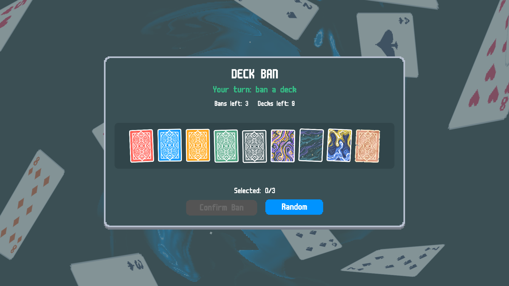

### 02 · Two of three selected
**Done:** clicked the 1st and 5th tiles.
**Should show:** both tiles raised with red **Selected** tags, counter
`Selected: 2/3`, Confirm still greyed (needs exactly 3).

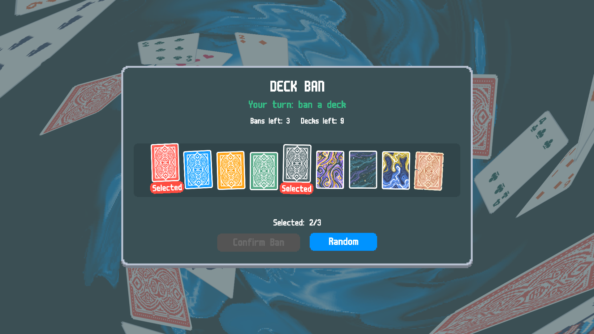

### 03 · Blind Random armed
**Done:** pressed Random.
**Should show:** no tiles raised, counter `?/3`, green **Confirm Random**,
red **Cancel Random**. Nothing about the roll is visible anywhere.

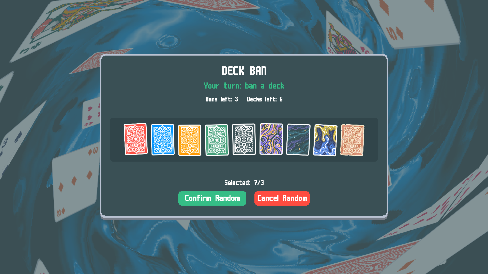

### 04 · Opponent's turn
**Done:** same draft, but the opponent acts first.
**Should show:** grey "Waiting for opponent…", counter and BOTH buttons
present but greyed — same layout as 01, nothing hidden.

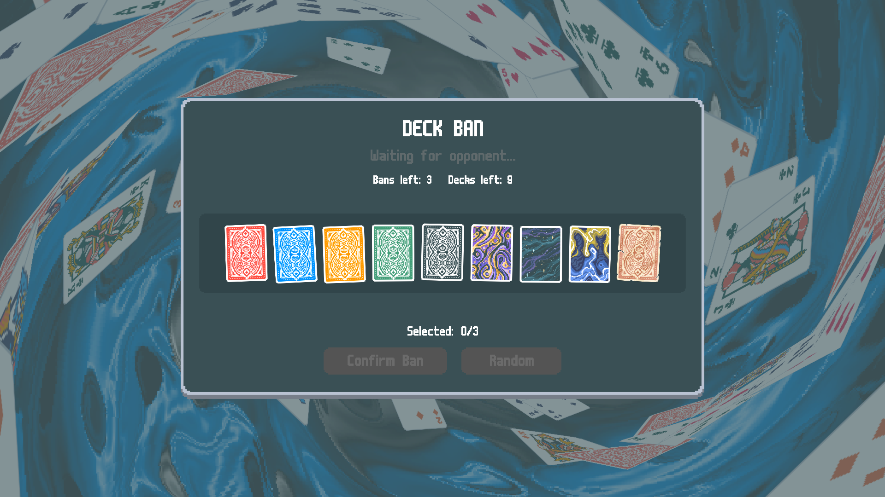

### 05 · Banned tiles
**Done:** the 2nd and 8th decks were banned.
**Should show:** those two tiles debuffed (darkened X overlay), Decks left: 7.

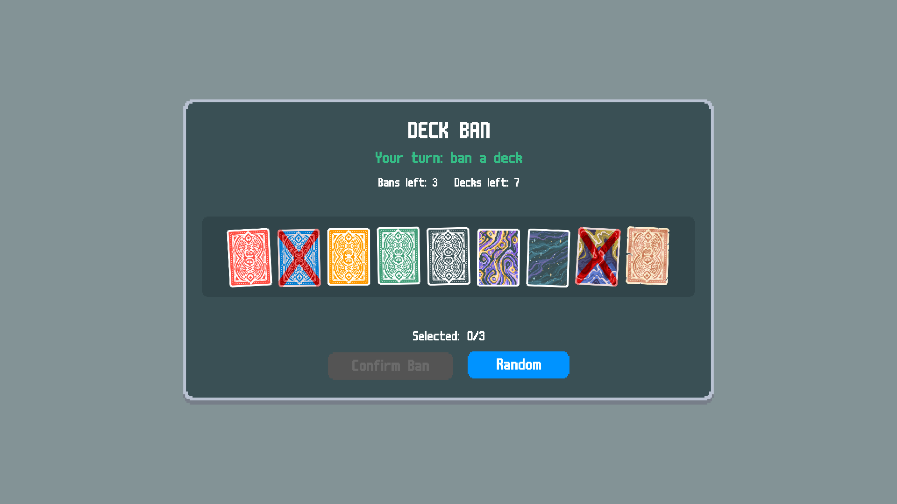

### 06 · Tuple hover with stake column
**Done:** hovered the 7th tile of a deck+stake pool (Nebula @ Blue Stake).
**Should show:** two-column popup — deck name/effects left; stake column right
with the stake's name in its colour, its description, and the cumulative
"Also applied" list. Fully on screen.

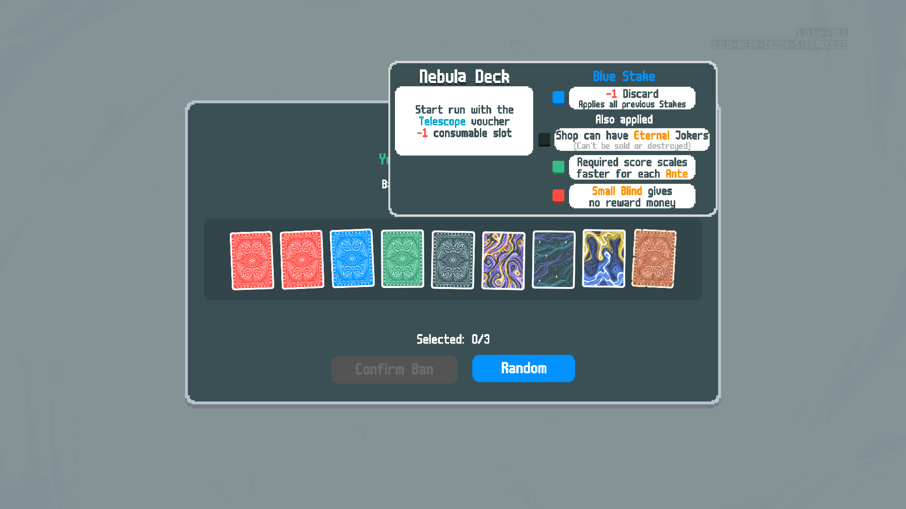

### 07 · Weekly cocktail badge, expanded
**Done:** hovered the badge pill above the tiles.
**Should show:** pill reads "Casjb Cocktail: Green Deck + Black Deck + Orange
Deck"; the expanded detail shows the three decks SIDE BY SIDE with full
effects, growing downward, fully on screen.

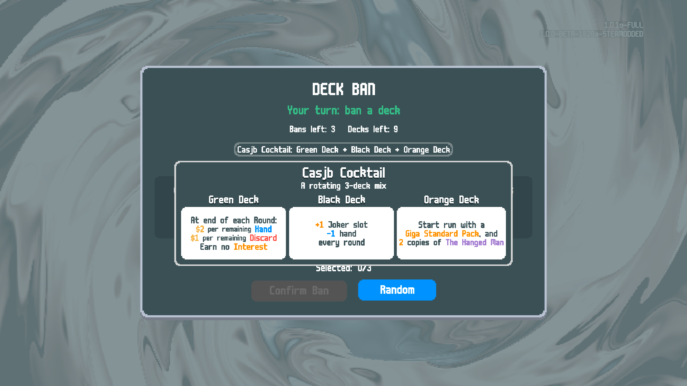

### 08 · Cocktail tile hover (compact)
**Done:** hovered the cocktail tile itself.
**Should show:** compact popup — title, "rotating 3-deck mix" line, three deck
NAMES only (no effect boxes), plus the stake column. Same footprint as a
normal deck's hover.

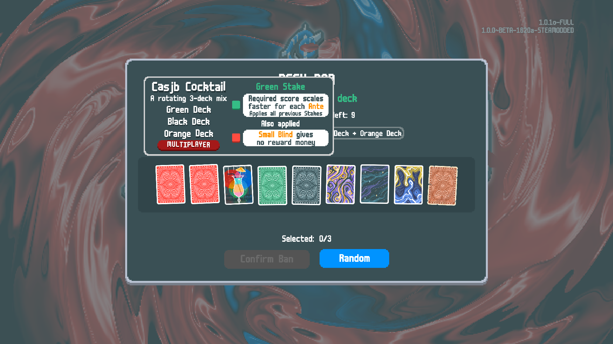

---

## Queue guard — every entry point, every button

### 09 · The guard overlay
**Done:** showed the guard (what any blocked action opens).
**Should show:** "Matchmaking In Progress", the can't-start-while-searching
description, and three buttons: blue **Leave Queue & Continue**, red
**Leave Queue**, green **Stay Queued**.

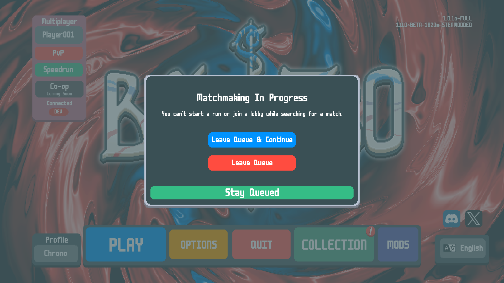

### 10 · Blocked from New Run setup
**Done:** opened New Run setup while queued (faked), clicked Play — through the
real wrapped `start_run`.
**Should show:** the guard overlay — it REPLACES the setup overlay (that's the
real behavior, they don't stack); the run did NOT start.

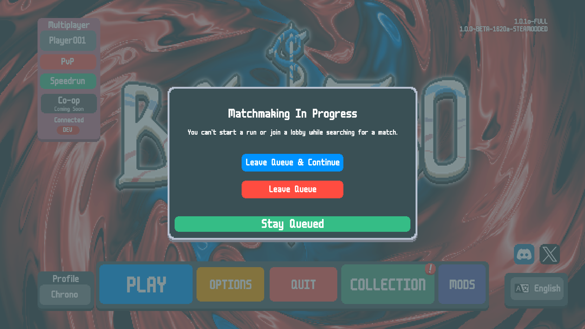

### 11 · Blocked from the challenge list
**Done:** same, but from the challenge list.
**Should show:** identical guard — challenges are blocked exactly like runs.

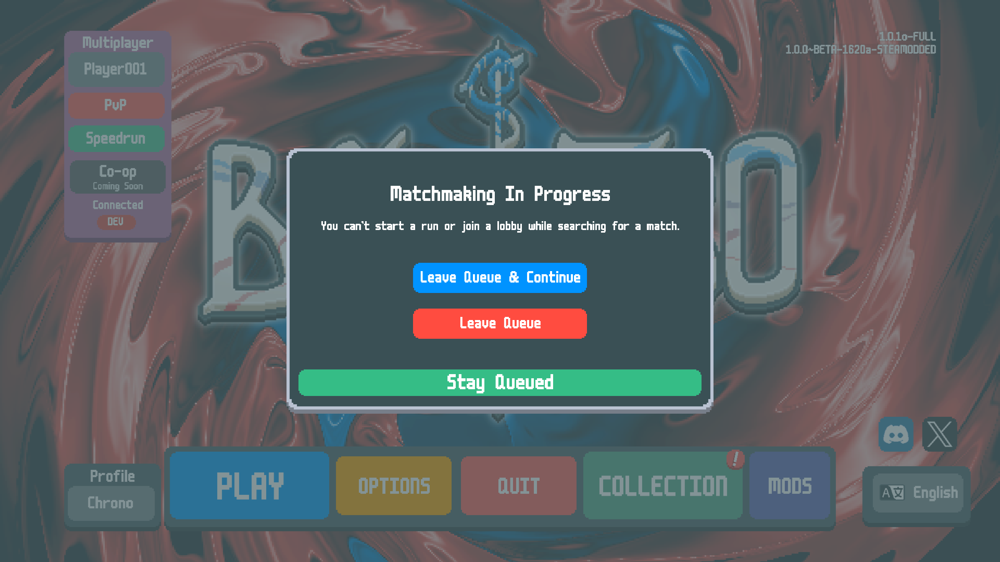

### 12 · After "Stay Queued"
**Done:** pressed Stay Queued on the guard.
**Should show:** overlay gone, back at the main menu, the search still active
— nothing else changed.

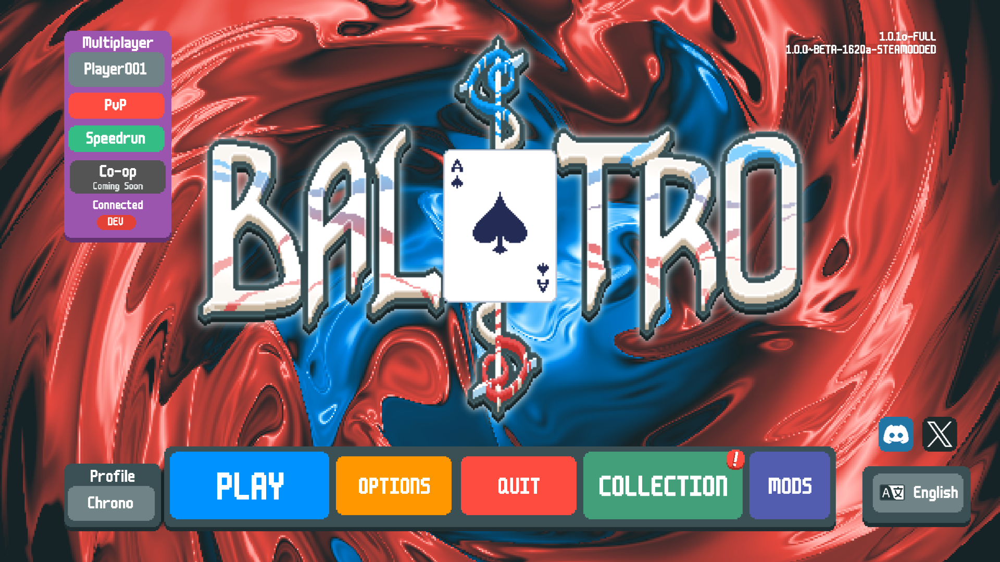

### 13 · After "Leave Queue"
**Done:** pressed Leave Queue.
**Should show:** overlay gone, menu bright/unpaused, search ended — and no
run started.

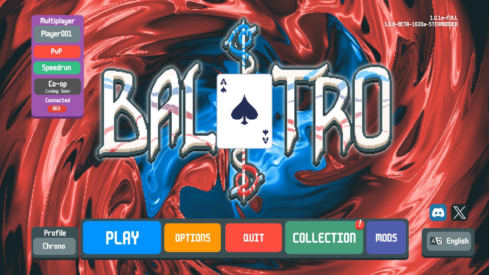

### 14 · After "Leave Queue & Continue"
**Done:** pressed Leave Queue & Continue from the New Run guard.
**Should show:** the queue is left AND the blocked run genuinely starts —
captured at the blind-select screen of a fresh **Red Deck** run (deck forced
for determinism; note 4 discards = Red Deck's bonus, confirming the deck).

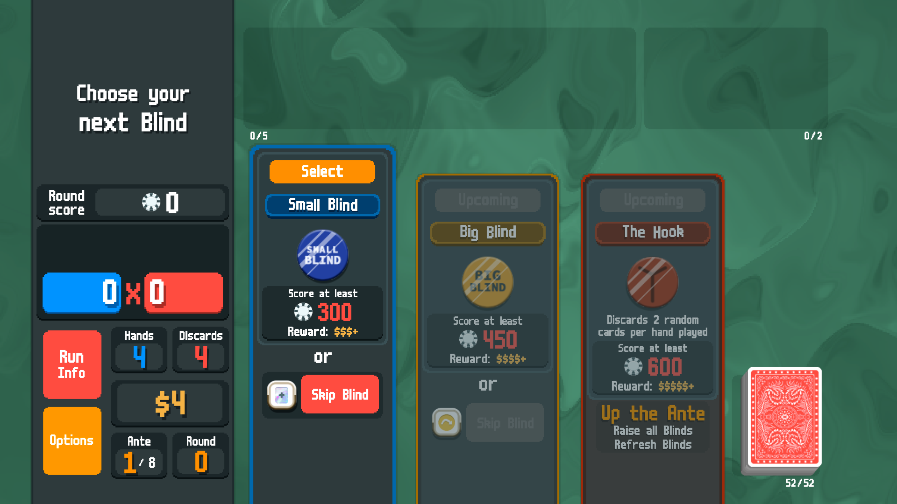
