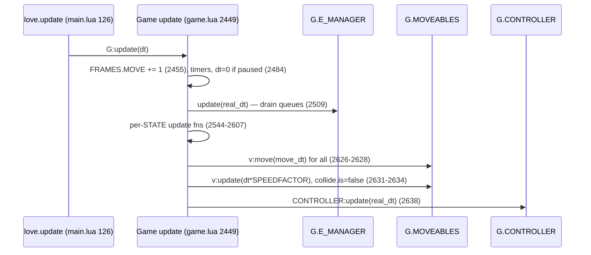
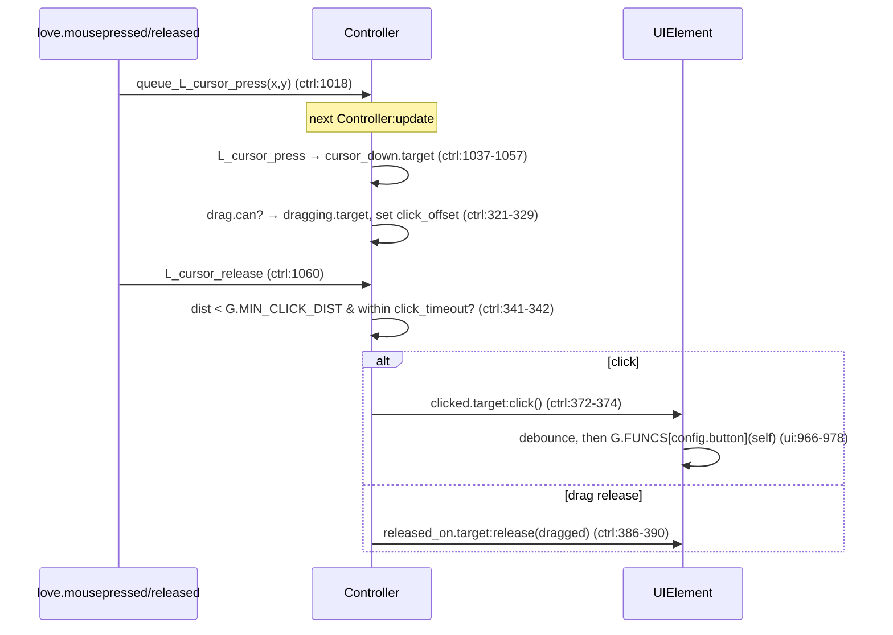
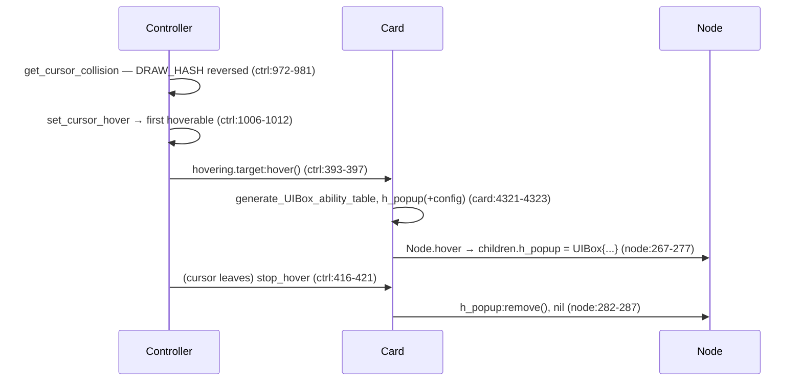

# 01 — Vanilla Engine Primitives

> Source referenced: the vanilla Balatro install (read-only), paths relative to
> `D:/SteamLibrary/steamapps/common/Balatro/Balatro/`. Every mod in this ecosystem is a set of
> hooks over these primitives; you cannot review multiplayer PRs without knowing what the hooks
> land on.

## 1. What this layer owns

The vanilla engine owns the whole runtime substrate mods build on: a fixed-order per-frame update
loop (`main.lua:126-129` → `Game:update` at `game.lua:2449`), a multi-queue **event manager** that
serializes gameplay animation/logic steps (`engine/event.lua`), the **Node → Moveable** scene-graph
with target/visible transforms, role bonds and stationary-object culling (`engine/node.lua`,
`engine/moveable.lua`), the retained-mode **UIBox/UIElement** tree that turns declarative
definition tables into positioned, clickable elements (`engine/ui.lua`), the **Controller** which
translates raw LÖVE input into hover/click/drag/release dispatch against a draw-order collision
list (`engine/controller.lua`), and the two gameplay containers **Card** and **CardArea**
(`card.lua`, `cardarea.lua`). Nothing here is threaded; everything is mutation of the global `G`
inside one frame tick, and ordering within `Game:update` is the only synchronization there is.

## 2. Key files

| File | Role | The one thing to know |
|---|---|---|
| `main.lua` | LÖVE entry; `love.update` calls `G:update(dt)` (`main.lua:126-129`) | All engine work happens inside one `Game:update` call per frame |
| `game.lua` | `Game:update` orchestrates timers, event queue, state machines, moveables, controller (`game.lua:2449-2638`) | When `G.SETTINGS.paused`, `dt` is zeroed for game logic (`game.lua:2484`) but `E_MANAGER` still runs on `real_dt` (`game.lua:2509`) |
| `engine/event.lua` | `Event` + `EventManager`: five named queues, blocking semantics | `blocking` and `blockable` both **default to true** (`event.lua:7-16`) |
| `engine/node.lua` | Base scene-graph node: collision, hover/drag popups, containers | `Node:hover` auto-creates a `UIBox` from `config.h_popup` (`node.lua:267-279`) |
| `engine/moveable.lua` | `T` (target) vs `VT` (visible) transforms, roles/bonds, easing | `STATIONARY` short-circuits all per-frame easing math (`moveable.lua:295-305`) |
| `engine/ui.lua` | `UIBox` (root Moveable) + `UIElement` tree built from definition tables | Layout happens once at build (`ui.lua:63-91`); per-frame only `config.func`/text refresh run (`ui.lua:938-955`) |
| `engine/controller.lua` | Input → hover/click/drag/release dispatch, controller focus, lock flags | Clicks are queued and resolved *inside* `Controller:update`, one frame later (`controller.lua:1018-1024`, `310-313`) |
| `cardarea.lua` | Ordered card container (hand/deck/jokers/shop/play) | `emplace`/`set_ranks` mutate the card's drag/collide states as a side effect (`cardarea.lua:214-227`) |
| `card.lua` | The game object for every card; hover popup construction | `Card:hover` rebuilds the ability UIBox on every hover start (`card.lua:4321-4323`) |

## 3. How it works

### 3.1 The event queue — `blocking` / `blockable` / `no_delete` / `clear_queue`

**The model in one line: Balatro has no threads — it has a to-do list the game walks once per
frame.**

Each entry is an `Event` holding a `func`. Walking the list calls each func; returning `true` means
"done, remove me", `false` means "call me again next frame". That `false` is the engine's *entire*
concept of waiting — no futures, no callbacks, just "not yet, ask again".

The two flags every event carries describe its relationship to the OTHER entries:

- **`blocking`** — *nothing behind me runs until I finish.* This is how animations stay ordered
  (card flies to hand → then score tallies → then the blind ends).
- **`blockable`** — *I am willing to wait for whatever is ahead of me.* Set it `false` and the event
  runs every frame regardless — what you want for ambient work: timer ticks, status polls, a
  screenshot runner.

Both default to **true**, so a bare `add_event(Event({func = ...}))` is maximally entangled: it
waits for everyone ahead AND blocks everyone behind. Most mod code wants
`blocking = false, blockable = false` — "just run me, leave the ordering alone".

`EventManager` keeps five independent queues (`unlock`, `base`, `tutorial`, `achievement`,
`other` — `event.lua:110-116`). Each tick it walks every queue front-to-back; the first event that
reports `blocking` sets a `blocked` flag, and after that only events with `blockable == false` are
still handled:

```lua
-- engine/event.lua:176-190
local blocked = false
local i=1
while i <= #v do
    ...
    if (not blocked or not v[i].blockable) then v[i]:handle(results) end
    if results.pause_skip then
        i = i + 1
    else if not blocked and results.blocking then blocked = true end
        if results.completed and results.time_done then
            table.remove(v, i)
        else
            i = i + 1
        end
    end
end
```

Because both flags default to `true` (`event.lua:7-16`), a plain
`G.E_MANAGER:add_event(Event({func = ...}))` is a serialized step: it waits for everything blocking
ahead of it and blocks everything behind it. Trigger types (`immediate`, `after`, `ease`,
`condition`, `before`) are resolved in `Event:handle` (`event.lua:48-103`); an event is only removed
when both `completed` and `time_done` are true (`event.lua:186-187`), so a `func` returning `false`
re-runs every tick — the engine's idiom for "wait until".

Two more semantics reviewers hit constantly:

- **Pause routing.** An event created while unpaused is *skipped* (not run, not removed) while the
  game is paused (`event.lua:50`), and its timer defaults to `'REAL'` when created paused vs
  `'TOTAL'` otherwise (`event.lua:22-23`). `TOTAL` runs at `G.SPEEDFACTOR` game speed
  (`game.lua:2495-2498`); `REAL` is wall-clock.
- **`clear_queue` respects `no_delete`** — this one is about *survival*, not ordering.
  `EventManager:clear_queue(queue, exception)` wipes the list except events flagged `no_delete`
  (`event.lua:133-169`). Vanilla calls it whenever a run starts or ends, cancelling every pending
  animation from the old screen. Anything that must outlive that transition needs the flag — the
  controller's own unlock event does exactly this (`controller.lua:199-210`). *Worked example:* the
  DevTools shot suite scheduled its next capture as a normal event; a scenario that started a real
  run hit `start_run` → `clear_queue()`, the capture event was deleted along with the run's leftover
  animations, and the suite silently stalled. The fix was one flag.
- `add_event(event, queue, front)` can push to the *front* of a queue (`event.lua:122-131`) —
  front-pushed blocking events preempt everything already scheduled.

### 3.2 Moveable: `T` vs `VT`, roles/bonds, `STATIONARY`, `lr_clamp`

**The model: a car with GPS.** `T` (target transform) is the destination you typed in; `VT`
(visible transform) is where the car actually is right now. Game code only ever sets destinations;
the engine drives everything toward them a little each frame (`moveable.lua:20-27`). Animation is
not a separate system — it is this gap closing. Read `VT` mid-animation and you get an in-between
value, not the destination. Need a teleport instead? `hard_set_T` snaps `VT = T`.

**Things can be strapped to other things.** A phone in your pocket doesn't navigate; it goes where
you go. That is a `Minor` attached to a `Major` (`moveable.lua:39-48`). A **Major** integrates its
own velocity (`move_xy`/`move_r`/`move_scale`/`move_wh`, `moveable.lua:306-313`). A **Minor** is
welded to its major by *per-property bonds*: `Strong` = "copy the major's value for this channel",
`Weak` = "compute my own" — so a hover popup can copy its card's position (Strong) while sizing
itself to its own content (Weak). **Glued** is the extreme: it shares the major's `T` table
outright — same coordinates, not a copy (`moveable.lua:329-341`).

**`STATIONARY` means "nobody moved, so skip the math."** Each frame a Major optimistically declares
itself stationary; any easing still covering distance flips it false. A Minor inherits that flag and
skips its own recalculation when the major didn't move — a dirty-flag optimization, and the reason a
UI tree of hundreds of elements costs almost nothing:

```lua
-- engine/moveable.lua:295-305
elseif self.role.role_type == 'Minor' and self.role.major then
    if self.role.major.FRAME.MOVE < G.FRAMES.MOVE then self.role.major:move(dt) end
    self.STATIONARY = self.role.major.STATIONARY
    if (not self.STATIONARY) or self.NEW_ALIGNMENT or
        self.config.refresh_movement or
        self.juice or
        self.role.xy_bond == 'Weak' or
        self.role.r_bond == 'Weak' then
            self.CALCING = true
            self:move_with_major(dt)
    end
```

*Worked example — the popup-clamp saga.* With a **stationary** anchor, moving a popup's outer box
did nothing visible: its children never re-followed, because the engine had already decided nothing
here moved. The fix for that case is to change something that marks the tree dirty — the alignment
offset, which raises `NEW_ALIGNMENT` — rather than the transform. With a **moving** anchor (a tile
rising because you selected it), everything recalculates every frame anyway, so clamping the
transform directly works. Two situations, two mechanisms: that is what the dual-clamp comment in
`api/ban_pick.lua` is about. Generally: a stuck element means nobody set
`NEW_ALIGNMENT`/`refresh_movement` after mutating `T` out-of-band. Majors set
`STATIONARY = true` each frame (`moveable.lua:307`) and any easing function that still has distance
to cover flips it false (`moveable.lua:415`, `428`, `439`, `452`). `move` is also re-entrancy
guarded per frame by `FRAME.MOVE >= G.FRAMES.MOVE` (`moveable.lua:279`), with `G.FRAMES.MOVE`
incremented once per `Game:update` (`game.lua:2455`).

Alignment codes are shorthand for *how* you attach to your parent: `'cm'` centered, `'tm'` above,
`'bm'` below (`i` = inside). `set_alignment` (`moveable.lua:94-112`) both sets the role (major +
bonds) and an alignment code string (`'cm'`, `'tm'`, `'bi'`, ...) which `align_to_major` converts into a `role.offset`
(`moveable.lua:114-188`) — but only when type or offset actually *changed*
(`moveable.lua:128-130`); the offset is cached otherwise. `lr_clamp`, set via alignment args,
clamps both `T.x` and `VT.x` into `G.ROOM` horizontally after each move
(`moveable.lua:315-317`, `322-327`) — the standard fix for popups hanging off-screen.
`hard_set_T` (`moveable.lua:190-208`) zeroes velocity and snaps `VT = T` — teleport, no ease.

### 3.3 UIBox / UIElement: build-time layout vs per-frame refresh

A `UIBox` is a Moveable whose constructor performs the *entire* layout pipeline once
(`ui.lua:63-91`): `set_parent_child` builds the `UIElement` tree from the definition table, then
`calculate_xywh` → `UIRoot:set_wh()` → `UIRoot:set_alignments()` → `align_to_major` →
`initialize_VT`. After that, nothing re-lays-out unless someone calls `UIBox:recalculate()`
(`ui.lua:306-318`). Per-element behavior is armed in `UIElement:set_values` at build time:

```lua
-- engine/ui.lua:373-374
if self.config.button_UIE then self.states.collide.can = true; self.states.hover.can = false; self.states.click.can = true end
if self.config.button then self.states.collide.can = true; self.states.click.can = true end
```

i.e. `config.button = 'some_G_FUNCS_key'` is what makes an element clickable at all; without it,
`UIElement:click` is a no-op. The click handler itself has a 0.1 s debounce, `one_press`
disabling, and dispatches through the global function registry `G.FUNCS[self.config.button](self)`
(`ui.lua:965-996`).

Per-frame, `UIElement:update` (`ui.lua:938-955`) does three things: runs `G.FUNCS[config.func](self)`
**every frame** if `config.func` is set (`ui.lua:948-951` — this is how vanilla enables/disables
buttons, and it runs once at build for buttons/`insta_func`, `ui.lua:463`), refreshes text, and
refreshes embedded objects. Live text is the `ref_table`/`ref_value` pattern:

```lua
-- engine/ui.lua:623-628
if self.config.ref_table and self.config.ref_table[self.config.ref_value] ~= self.config.prev_value then
    self.config.text = tostring(self.config.ref_table[self.config.ref_value])
    self.config.text_drawable:set(self.config.text)
    if not self.config.no_recalc and self.config.prev_value and string.len(self.config.prev_value) ~= string.len(self.config.text) then self.UIBox:recalculate() end
    self.config.prev_value = self.config.ref_table[self.config.ref_value]
end
```

A `G.UIT.T` node pointed at a live table auto-updates its drawable, and auto-recalculates the whole
box when the string *length* changes — meaning a same-length value change never re-lays-out, and a
hot loop mutating a watched value can recalc every frame. `UIElement:hover` converts
`config.tooltip` / `config.on_demand_tooltip` / `config.detailed_tooltip` into an `h_popup`
definition before delegating to `Node.hover` (`ui.lua:1022-1036`).

### 3.4 Controller dispatch: collision list → hover → click/drag

Raw LÖVE callbacks do not act immediately: `queue_L_cursor_press` just stores coordinates
(`controller.lua:1018-1024`), and `Controller:update` — called *last* in the frame
(`game.lua:2638`) — drains them (`controller.lua:310-313`). Collision candidates come from
`G.DRAW_HASH`, appended during draw (`functions/misc_functions.lua:669-671`) and iterated in
**reverse** so the topmost-drawn object wins (`controller.lua:972-981`). `set_cursor_hover` picks
the first hoverable candidate, or `G.ROOM` when locked/none (`controller.lua:984-1016`, lock
short-circuit at `992`). Press marks a `cursor_down.target` (click-capable node, else its
`can_drag()` result, else `G.ROOM`, `controller.lua:1049-1057`); release decides click vs
drag-release:

```lua
-- engine/controller.lua:341-351
if (not self.cursor_down.target.click_timeout or self.cursor_down.target.click_timeout*G.SPEEDFACTOR > self.cursor_up.time - self.cursor_down.time) then
    if Vector_Dist(self.cursor_down.T, self.cursor_up.T) < G.MIN_CLICK_DIST then
        if self.cursor_down.target.states.click.can then
            self.clicked.target = self.cursor_down.target
            self.clicked.handled = false
        end
    --if not, was the Cursor dragging some other thing?
    elseif self.dragging.prev_target and self.cursor_up.target and self.cursor_up.target.states.release_on.can then
        self.released_on.target = self.cursor_up.target
```

Dispatch then fires in fixed order each frame: `clicked.target:click()` → registry → dragged
target's `:drag()` → `released_on.target:release(dragged)` → hover transitions calling `:hover()` /
`:stop_hover()` (`controller.lua:372-425`). Note touch input defers `hover()` through a
non-blocking event with `G.MIN_HOVER_TIME` delay (`controller.lua:398-411`). Global input freezes
are the `G.CONTROLLER.locks` table — any truthy lock makes hover resolve to `G.ROOM` and press
handlers early-return (`controller.lua:186-194`, `992`, `1041`).

Card popups ride this: `Card:hover` regenerates `self.ability_UIBox_table`, sets `config.h_popup` +
`config.h_popup_config = self:align_h_popup()` and calls `Node.hover` (`card.lua:4306-4327`), which
instantiates the popup UIBox as `children.h_popup` with `instance_type = 'POPUP'`
(`node.lua:267-279`). `align_h_popup` chooses `'cl'` for shop/deck-view, else `'bm'` above ~0.8
card-heights from the top, else `'tm'` (`card.lua:4275-4304`). `stop_hover` removes the box
(`node.lua:282-287`).

## 4. Main flows







## 5. Invariants & gotchas

- **Everything downstream of the event queue assumes serialization.** A blocking `base`-queue event
  is the mutual-exclusion primitive of the whole game. An event with `blockable = false` jumps the
  line (`event.lua:182`); an event whose `func` returns `nil`/`false` spins forever and, if
  `blocking`, deadlocks its queue — the classic "game soft-locks after my hook" bug.
- **`clear_queue` deletes your pending events** unless they carry `no_delete` (`event.lua:133-169`).
  Network-response events queued by a mod die silently on state wipes without it.
- **Write `T`, never `VT`,** and after out-of-band `T` mutation on aligned Minors set
  `NEW_ALIGNMENT` or the STATIONARY gate may never re-weld them (`moveable.lua:295-305`).
  `align_to_major` early-returns when alignment type+offset are unchanged (`moveable.lua:128-130`),
  so mutating `alignment.offset.x` *in place* on the same table is detected, but replacing offsets
  with an equal-valued table is a no-op.
- **UIBox layout is build-time.** Changing node sizes/text lengths requires `UIBox:recalculate()`
  (`ui.lua:306-318`); the only automatic triggers are the text length change (`ui.lua:626`) and
  object swap (`ui.lua:632-635`). Conversely, a `config.func` runs *every frame for every visible
  element* (`ui.lua:948-951`) — heavy work there is a frame-rate bug.
- **`CardArea:emplace` is not a plain insert.** It front-inserts for decks, auto-flips face-down
  cards unless the area is discard/deck or `stay_flipped` (`cardarea.lua:33-40`), *grows*
  `G.deck.config.card_limit` on overflow (`cardarea.lua:45-49`), then calls
  `set_ranks` + `align_cards` (`cardarea.lua:52-53`). `set_ranks` overwrites every card's
  `drag.can`/`collide.can` by area type — `play`/`shop`/`consumeable` cards are made undraggable,
  everything else draggable (`cardarea.lua:214-227`). A mod toggling those states directly gets
  them clobbered on the next emplace/remove. `CardArea:move` re-runs `align_cards` every frame
  (`cardarea.lua:229-241`), so positional hacks on contained cards must go through the area.
- **Input is frame-deferred and lock-gated.** A click "lost" during transitions is usually
  `G.CONTROLLER.locks.frame`/`wipe` (`controller.lua:189-220`, `1019`, `1041`). Hover targets
  resolve topmost-drawn-first; an invisible collider drawn late (e.g. a full-screen overlay with
  `collide.can`) swallows all hover/click below it.

## 6. Review lens

- **Every `add_event` in the diff:** are `blocking`/`blockable` deliberate (remember both default
  true, `event.lua:7-16`)? Does the `func` return `true` on every path? Does it need `no_delete`
  to survive `clear_queue`, and the right `timer` (`REAL` vs speed-scaled `TOTAL`)?
- **Position code:** does it write `T` (not `VT`) and set `NEW_ALIGNMENT`/`refresh_movement` when
  bypassing `set_alignment`? Off-screen risks handled with `lr_clamp` (`moveable.lua:111`, `322-327`)?
- **UI defs:** clickable things have `config.button` + a registered `G.FUNCS` entry (`ui.lua:374`,
  `978`); dynamic text uses `ref_table`/`ref_value` instead of rebuilding boxes; any new
  `config.func` is O(small) since it runs per frame per element (`ui.lua:948-951`).
- **Card/area mutations:** cards enter/leave areas only via `emplace`/`remove_card`/`draw_card_from`;
  any manual `states.drag.can` tweak survives the next `set_ranks` (`cardarea.lua:214-227`)?
- **Popups:** custom hover UIs set both `config.h_popup` and `config.h_popup_config`
  (`node.lua:267-279`) and get cleaned by `stop_hover` — leaked `children.h_popup` means a stuck
  tooltip.
- **Anything touching input:** does it respect `G.CONTROLLER.locks` and the one-frame deferral of
  clicks (`controller.lua:310-313`)? Does a new overlay disable `collide.can` when it should be
  click-through (`ui.lua:48-52`)?
