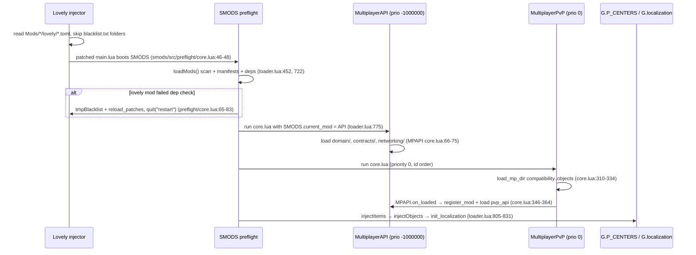
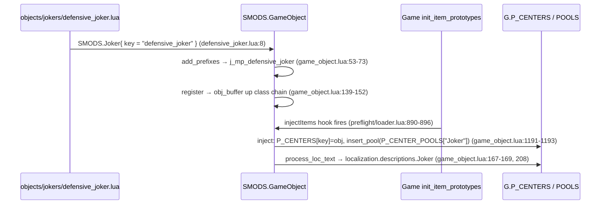

# 02 — Loaders: Lovely + Steamodded (SMODS)

> Path conventions in this chapter: bare paths like `lovely/game.toml` are relative to
> `D:/pvpserver/BalatroMultiplayer`; `smods/...` is the installed Steamodded checkout at
> `C:/Users/micha/AppData/Roaming/Balatro/Mods/smods`; `MPAPI:` prefixes files in
> `D:/pvpserver/BalatroMultiplayerAPI`; `DevTools:` prefixes `D:/pvpserver/BalatroMultiplayerDevTools`.

## 1. What this layer owns

This layer is everything that happens before a single line of multiplayer game logic runs: the
**Lovely injector** rewrites vanilla Balatro source at load time using declarative TOML patches
(`lovely/*.toml` in each mod), and **Steamodded (SMODS)** discovers mod folders under
`Mods/`, parses their JSON manifests, resolves dependencies/conflicts/priorities, executes each
mod's `main_file` in priority order, and finally *injects* every registered game object
(jokers, decks, editions, ...) into the vanilla registries `G.P_CENTERS` / `G.P_CENTER_POOLS`
along with merged localization. The three repos in this ecosystem are all SMODS mods:
`MultiplayerAPI` (loads first), `MultiplayerPvP` (depends on it), and
`BalatroMultiplayerDevTools` (dev-only). If a PR touches a `.toml`, a `*.json` manifest, or a
`load_mp_dir`/`load_mpapi_dir` call, it is touching this layer.

## 2. Key files

| File | Role | The one thing to know |
|---|---|---|
| `lovely/*.toml` (19 files) | Lovely patch definitions rewriting vanilla + SMODS source | Patches are string/regex surgery on source text — a vanilla update that reformats a target line silently breaks the patch |
| `lovely/game.toml:1-4` | Core game patches manifest | `priority = 2147483600` (near i32 max) and `dump_lua = true` — patched output lands in `Mods/lovely/dump/` for inspection |
| `MultiplayerPvP.json` | PvP mod manifest | `prefix: "mp"`, `priority: 0`, depends on `MultiplayerAPI`; conflicts pin versions (e.g. `Talisman (<=2.0.2)`) |
| `MPAPI: MultiplayerAPI.json` | API mod manifest | `priority: -1000000` — the API is guaranteed to execute before every other mod |
| `DevTools: BalatroMultiplayerDevTools.json` | Dev tooling manifest | `prefix: "bmpdev"`, depends on `MultiplayerAPI (>=0.1.0)`; not shipped to players |
| `smods/src/preflight/loader.lua` | Mod discovery, manifest parsing, dependency check, load order | `loadMods` scans `Mods/` max 3 levels deep (`:244-247`); `load_mods` runs main files sorted by priority then id (`:734-747`) |
| `smods/src/preflight/core.lua` | SMODS bootstrap ("preflight") | Reads `lovely.mod_dir`, wires NFS/JSON globals, and can force a restart with a temp blacklist on conflicts (`:65-83`) |
| `Mods/lovely/blacklist.txt` | Runtime profile switch (which mod folders are disabled) | One folder name per line, `#` comments (`smods/src/preflight/loader.lua:14-19`); this is how the dev stack disables the released `multiplayer-0.5.2`, `Saturn`, etc. |
| `smods/src/game_object.lua` | `SMODS.GameObject` class tree, prefixing, injection | `SMODS.Center.inject` is where `G.P_CENTERS[key]` and `G.P_CENTER_POOLS[set]` actually get written (`:1191-1193`) |
| `smods/src/utils.lua` | Localization loading/merge + pool helpers | `load_mod_localization` loads `en-us` first, then the active language, both with `force` (`:222-228`) |
| `core.lua` (MultiplayerPvP) | PvP main file — loads every other MP file | `MP.load_mp_dir` sorts `_`-prefixed entries first, then directories, then alphabetical (`core.lua:143-171`) |
| `MPAPI: core.lua` | API main file | Extends `package.path` so the MQTT worker thread can `require("mqtt")` from `lib/` (`:3-15`) |

## 3. How it works

### 3.1 Lovely patches: declarative source rewriting

Each `[[patches]]` entry names a `target` file inside the vanilla source, a `pattern` to find,
a `position` (`before` / `after` / `at`), and a `payload` to splice in. Example — gating the
"select blind" button swap so it can't clobber the multiplayer ready button
(`lovely/game.toml:187-198`):

```toml
[[patches]]
[patches.pattern]
target = '''functions/button_callbacks.lua'''
pattern = """_top_button.config.button = 'select_blind'"""
position = "at"
payload = '''
if _top_button.config.button ~= "mp_toggle_ready" then
	_top_button.config.button = "select_blind"
end
'''
match_indent = true
times = 1
```

`[patches.regex]` variants support named capture groups reinserted via `$name` — see
`lovely/game.toml:6-13`, which captures the body of `Game:update_round_eval` as `(?<pre>...)`
and re-emits it with `$pre`. `times = N` caps how many occurrences are rewritten
(`lovely/game.toml:184` uses `times = 3` to hit three copies of the same loop).

Two non-obvious target forms:

- **Patching SMODS itself.** SMODS loads its own source with synthetic chunk names —
  `assert(load(SMODS.NFS.read(SMODS.path..path), ('=[SMODS _ "%s"]'):format(path)))()`
  (`smods/src/core.lua:11`) — and Lovely patches those chunks by that exact name. MP does this
  to replace the enhancement pool used by Grim/Familiar/Incantation:
  `target = '''=[SMODS _ "src/game_object.lua"]'''` (`lovely/game.toml:175-184`), and to fix a
  Steamodded seal RNG bug (`lovely/TheOrder.toml:209-222`).
- **Blacklist as profile switch.** Lovely skips patch directories for any folder listed in
  `Mods/lovely/blacklist.txt`; SMODS reads the same file and marks those mods
  `disabled`/`blacklisted` (`smods/src/preflight/loader.lua:341-344`). SMODS proves the file is
  Lovely-authoritative by writing a temp blacklist and calling `lovely.reload_patches()` when it
  must disable a conflicting lovely mod (`smods/src/preflight/core.lua:51-63`), then restarting
  the game (`smods/src/preflight/core.lua:77-82`). On this dev machine the blacklist disables the released
  `multiplayer-0.5.2`, `Saturn`, `CompetitiveBalatro`, `BMM-Compat` — flipping lines in that file
  is how you switch between the release profile and the dev stack. A `.lovelyignore` file inside
  a mod folder is the per-mod equivalent (`smods/src/preflight/loader.lua:337-340`).

### 3.2 Manifest parsing, dependency resolution, load order

`loadMods` walks `Mods/` (depth ≤ 3, zips get mounted, `smods/src/preflight/loader.lua:244-296`)
and validates every `*.json` against a spec: `id`, `name`, `author`, `description`, `prefix`,
`main_file` are required; `priority` defaults to 0 (`:135-240`). Dependency strings carry an
operator grammar — `"Steamodded (>=1.0.0~BETA-1221a)"` parses into `{op, ver}` pairs with
`<<`, `>>`, `<=`, `>=`, `==` and `|` alternatives (`:152-185`). `check_dependencies` recurses so
a dependency whose *own* dependencies fail also fails you (`:585-635`). Duplicate `prefix`es
become synthetic conflicts where the later-loading mod loses (`:694-727`).

Execution order is **priority ascending, then mod id alphabetical** within a priority bucket
(`smods/src/preflight/loader.lua:734-747`):

```lua
for _, priority in ipairs(keyset) do
    table.sort(SMODS.mod_priorities[priority],
    function(mod_a, mod_b)
        return SMODS.Mods[mod_a].id < SMODS.Mods[mod_b].id
    end)
```

This is why `MultiplayerAPI.json` declares `"priority": -1000000`: the API must define
`MPAPI` before `MultiplayerPvP` (priority 0) runs `MPAPI.on_loaded(...)` at
`core.lua:346`. Each main file is executed with `SMODS.current_mod` set (`:748,763-776`) —
that global is how `MP = SMODS.current_mod` (`core.lua:1`) and
`MPAPI = SMODS.current_mod` (`MPAPI: core.lua:1`) capture their own mod tables.

### 3.3 `SMODS.load_file` and the mods' own loaders

Mods don't `require()` their files — `SMODS.load_file(path, id)` reads via NFS and compiles
with the lovely-patchable chunk name (`smods/src/preflight/loader.lua:865-887`):

```lua
local chunk, err = load(file_content, "=[SMODS " .. mod.id .. ' "' .. path .. '"]')
```

Both mods wrap it: `MP.load_mp_file` (`core.lua:128-141`) and `MPAPI.load_mpapi_file`
(`MPAPI: core.lua:29-42`) pcall the chunk and log failures instead of crashing. Directory
loading differs between the two and the difference is load-bearing:

- `MP.load_mp_dir` **sorts**: `_`-prefixed names first (+100), directories before files (+10),
  then case-insensitive alphabetical (`core.lua:143-171`). A file named `_init.lua` in a dir is
  guaranteed to run before its siblings.
- `MPAPI.load_mpapi_dir` does **no sorting** — NFS enumeration order (`MPAPI: core.lua:44-58`);
  ordering is instead handled by explicit call sequence (`domain` and `contracts` load before
  `networking`, `MPAPI: core.lua:64-67`).

MP's full content load sequence is the block at `core.lua:310-334` (`compatibility` →
`networking/action_handlers.lua` → `gamemodes` → `layers` → `rulesets` → `ui` → `objects/*`).
One deliberate exception: `pvp_api` is loaded *inside* the `MPAPI.on_loaded` callback so its
GameObjects get tagged to the MP mod for per-lobby routing (`core.lua:362-364`).

### 3.4 Center registration → `G.P_CENTERS` / `G.P_CENTER_POOLS`

Calling a class like `SMODS.Joker{ key = "defensive_joker", ... }`
(`objects/jokers/defensive_joker.lua:8-11`) runs `SMODS.GameObject:__call`
(`smods/src/game_object.lua:24-39`): it stamps `o.mod = SMODS.current_mod`, applies prefixes,
checks for duplicate keys, and registers. Prefixing (`:41-105`) rewrites the key to
`<class_prefix>_<mod.prefix>_<key>` — MP's manifest prefix `"mp"` turns `defensive_joker`
into `j_mp_defensive_joker`, which is why `MultiplayerPvP.json`'s `"prefix": "mp"` can never
change without breaking every saved run and localization key. `register` then appends the key
to `obj_buffer` on the class *and every parent class* (`:139-152`).

Registration only fills buffers. The write into vanilla registries happens at **injection**:
SMODS hooks `Game:init_item_prototypes` (`smods/src/preflight/loader.lua:889-899`) to call
`SMODS.injectItems` → `SMODS.injectObjects` walks the class tree (`smods/src/game_object.lua:278-284`)
and `inject_class` calls `o:inject(i)` then `o:process_loc_text()` per object (`:204-208`).
For centers (`smods/src/game_object.lua:1191-1193`):

```lua
inject = function(self)
    G.P_CENTERS[self.key] = self
    if not self.omit then SMODS.insert_pool(G.P_CENTER_POOLS[self.set], self) end
```

So `G.P_CENTERS` is the flat key→object map and `G.P_CENTER_POOLS[set]` ("Joker", "Back",
"Enhanced", ...) are the arrays that shop/pack generation iterates — which is exactly why MP's
lovely patch retargets the `G.P_CENTER_POOLS["Enhanced"]` loop (`lovely/game.toml:175-184`)
to enforce enhancement bans.

### 3.5 Localization: the en-us base + forced overlay

Two mechanisms coexist:

1. **File-based** (`localization/<lang>.lua|json`): during injection, an internal pre-inject
   class loads every loadable mod's localization dir (`smods/src/game_object.lua:4010-4015`).
   `SMODS.load_mod_localization` loads **`en-us` first, then `default`, then
   `G.SETTINGS.language`, then `real_language` — all with `force = true`**
   (`smods/src/utils.lua:222-228`). The merge (`:196-210`) recurses into `G.localization`,
   adding missing keys and, because of `force`, overwriting existing leaves (strings and
   arrays-of-strings). Net semantics: `en-us` is the complete base; the active language
   overlays it; anything the translation misses stays English rather than erroring. MP ships 16
   languages (`localization/`), the API only `en-us` (`MPAPI: localization/`).
2. **Per-object `loc_txt`**: `SMODS.process_loc_text` picks
   `real_language or language or default or en-us` from the object's `loc_txt` table
   (`smods/src/utils.lua:181-187`) and writes it into `G.localization.descriptions[set][key]`
   during that object's injection (`smods/src/game_object.lua:167-169`).

After all injection, `SMODS.injectItems` calls `init_localization()` and asserts every center
had its discovery state overridden (`smods/src/preflight/loader.lua:817-830`).

## 4. Main flows

### Boot: injector → preflight → mods → injection



### One joker: file → registries



## 5. Invariants & gotchas

- **Lovely patches match text, not semantics.** Every `pattern` in `lovely/*.toml` is coupled to
  the exact vanilla (or SMODS) source string, including whitespace when `match_indent = true`. A
  Balatro or Steamodded update that touches a target line makes the patch silently not apply —
  the game still boots, the feature just vanishes. Check `Mods/lovely/log/` ("Applied N patches
  to ...") and the `dump_lua` output in `Mods/lovely/dump/` when behavior disappears.
- **`priority` in a lovely `[manifest]` and `priority` in the SMODS JSON are different systems.**
  `lovely/game.toml:4` (2147483600) orders *patch application*; `MultiplayerAPI.json`'s
  `-1000000` orders *mod main-file execution*. Confusing them is a classic review miss.
- **Load order within a priority bucket is alphabetical by mod id**
  (`smods/src/preflight/loader.lua:741-744`) — MP and DevTools are both priority 0, so
  `BalatroMultiplayerDevTools` runs *before* `MultiplayerPvP`. DevTools may only rely on
  `MPAPI` at top level, never on `MP`.
- **Registration ≠ injection.** `SMODS.Joker{...}` at mod-load time only buffers the object;
  `G.P_CENTERS`/`G.P_CENTER_POOLS` don't contain it until `Game:init_item_prototypes` fires
  (`smods/src/preflight/loader.lua:890-896`). Code that reads pools during mod load reads
  vanilla-only data.
- **Keys are auto-prefixed.** `key = "defensive_joker"` under mod prefix `mp` becomes
  `j_mp_defensive_joker` (`smods/src/game_object.lua:53-73`). Content referencing raw keys, and
  the manifest `prefix` itself, are save-format-breaking to change. Duplicate prefixes across
  mods get the later mod auto-conflicted (`smods/src/preflight/loader.lua:702-719`).
- **`en-us.lua` must contain every key.** The loc merge loads `en-us` before the active language
  with `force = true` (`smods/src/utils.lua:225-227`); a key missing from `en-us` but present
  only in `de.lua` works in German and shows a raw key everywhere else. Add new strings to
  `localization/en-us.lua` first, other languages optionally.
- **`blacklist.txt` mutates at runtime.** SMODS itself appends to it when it deduplicates
  multiple enabled versions of one mod id (`smods/src/preflight/loader.lua:487-495`) and during
  conflict-restart (`smods/src/preflight/core.lua:51-63`). Don't treat the file as static config
  in tooling; and remember the dev machine uses it to hard-disable the released
  `multiplayer-0.5.2`/`Saturn` stack.
- **`MP.load_mp_dir` ordering is a feature.** Underscore-prefixed files/dirs load first
  (`core.lua:152-160`); renaming `_foo.lua` → `foo.lua` reorders initialization.

## 6. Review lens

- **New/changed `.toml` patch:** does `times` match the real occurrence count, is `position`
  right (`at` replaces, `before`/`after` splice), and was it verified against the *current*
  vanilla/SMODS source string — including targets of the form `=[SMODS _ "src/..."]`
  (`lovely/game.toml:175-184`)? Ask for a `Mods/lovely/log` line or `dump/` diff as proof it
  applied.
- **Manifest edits:** any change to `prefix` is save-breaking; `priority` changes reorder
  every main file; new `dependencies`/`conflicts` strings must follow the operator grammar
  parsed at `smods/src/preflight/loader.lua:152-217` (typos fail silently into "mod won't load").
- **New content file:** is it reached by an existing `MP.load_mp_dir` call
  (`core.lua:310-334`)? A file in an unlisted subdirectory (non-recursive `load_mp_dir`) never
  loads — no error, just absent content.
- **Pool reads at load time:** flag any top-level code touching `G.P_CENTERS`/
  `G.P_CENTER_POOLS` in a mod file — those tables aren't populated with modded content until
  injection (`smods/src/game_object.lua:1191-1193`); such reads belong in callbacks/hooks.
- **Localization:** every new `localize(...)` key must exist in `localization/en-us.lua` (the
  forced base, `smods/src/utils.lua:225`); per-object `loc_txt` needs at minimum an `en-us` or
  `default` branch (`smods/src/utils.lua:181-187`).
- **Cross-mod init order:** anything in MP that needs the API at load time is fine (`priority
  -1000000` guarantees it), but code needing the API *connected* must go through
  `MPAPI.on_loaded` (`core.lua:346`); DevTools must not reference `MP` at top level (alphabetical
  ordering, `smods/src/preflight/loader.lua:741-744`).
