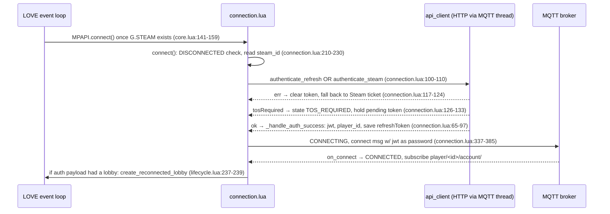
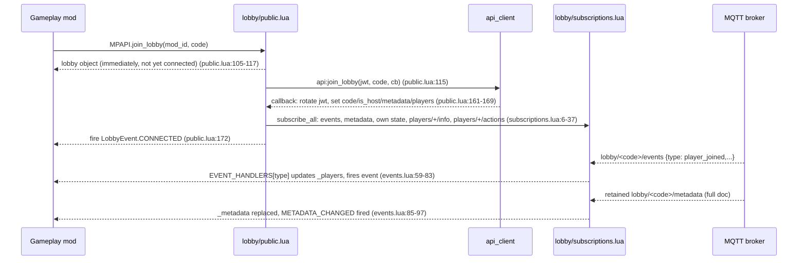
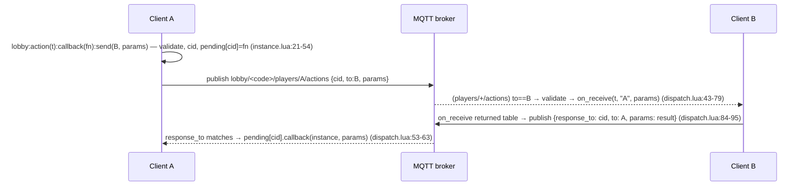

# 03 — BalatroMultiplayerAPI core: connection, lobby, actions

All paths in this chapter are relative to the `BalatroMultiplayerAPI` repo (branch `dev-local`).

## What this layer owns

This layer is the client-side multiplayer kernel that every gameplay mod builds on: it boots the mod and loads all subsystems in dependency order (`core.lua`), runs the connection/auth state machine from Steam ticket (or refresh token, or dev impersonation) to an authenticated MQTT session (`networking/connection.lua`), and exposes the lobby object — a per-match room with players, host flag, shared metadata, and an event emitter (`api/lobby/*.lua`). On top of the lobby it provides the action framework: typed, schema-validated messages (`MPAPI.ActionType`) that mods `send` to one player or `broadcast` to all, routed per-mod through MQTT topics (`api/action/*.lua`), plus the synced-object layer that hides all of that behind `self:sync(...)` on Blind/Joker/Consumable definitions (`api/synced/`). Everything is callback-driven; there are no blocking calls — MQTT and HTTP both run on a worker thread and results come back through the LOVE event loop.

## Key files

| File | Role | The one thing to know |
|---|---|---|
| `core.lua` | Boot sequence | Load order is load-bearing: `domain/` + `contracts/` first because `networking/` references enums at load time (`core.lua:64-67`); `MPAPI.connect()` is only called once `G.STEAM` exists (`core.lua:141-159`) |
| `domain/connection_state.lua` | Connection state enum | 6 states; values are lowercase wire strings (`connection_state.lua:1-8`) |
| `domain/lobby_event.lua` | Lobby event enum | PLAYER_*/METADATA_CHANGED/HOST_CHANGED/LOBBY_CLOSED double as the server message `type` field; CONNECTED/DISCONNECTED/ERROR/PLAYER_INFO are client-side only (`lobby_event.lua:1-5`) |
| `networking/connection.lua` | Auth + connection state machine | `_do_auth` prefers a saved refresh token, falls back to a fresh Steam ticket (`connection.lua:100-110`); DevTools monkey-patches `_do_auth` to impersonate |
| `networking/api_client/auth.lua` | Auth HTTP endpoints | All HTTP goes through the MQTT worker thread (`self.mqtt:http_post`), incl. dev `/api/auth/dev/impersonate` (`auth.lua:30-40`) |
| `api/connection/lifecycle.lua` | Public connect API + endpoint resolution | Endpoint precedence: explicit `MPAPI.connect{opts}` > SMODS-config custom server > production defaults (`lifecycle.lua:103-113`); also owns `MPAPI.on_loaded` |
| `api/connection/state.lua` | `MPAPI.connection_state` view | The read-only table the account UI renders; mirrors the connection on every state change |
| `api/lobby/state.lua` | Lobby object factory | All lobby methods + the `_fire` emitter live in one closure-based constructor (`state.lua:7-157`) |
| `api/lobby/public.lua` | create/join/local/reconnect entry points | Callbacks are async: the lobby object is returned immediately, `CONNECTED` fires later (`public.lua:34-36`) |
| `api/lobby/subscriptions.lua` | MQTT topic wiring | The only place lobby subscriptions are created — 5 topics + chat (`subscriptions.lua:6-37`) |
| `api/lobby/events.lua` | Inbound lobby message handlers | Table-dispatched by `data.type` (`events.lua:59-67`); every handler bails on `lobby._destroyed` |
| `api/action/registry.lua` | `MPAPI.ActionType` GameObject | An SMODS GameObject with `required_params = { 'key', 'on_receive' }` (`registry.lua:3-10`) |
| `api/action/instance.lua` | Outbound send/broadcast | Sender publishes to its **own** actions topic; addressing is inside the payload (`to` field) (`instance.lua:40-48`) |
| `api/action/dispatch.lua` | Inbound routing + request/response | Responses match by `response_to` → `_pending_actions[cid]` (`dispatch.lua:53-63`) |
| `api/action/validation.lua` | Param schema validation | Pure function, runs on **both** send and receive (`validation.lua:3-17`) |
| `api/synced/core.lua` | Sync bus + mixin | One `mpapi_sync` ActionType per consumer mod, demuxed by object key; self-echo suppressed for `sync`/`phantom`, not for `request` (`core.lua:22-38`) |
| `api/lobby_flow.lua` | Ready/vote/resync helpers | `ready_resync` re-broadcasts to beat the join-time subscribe race (`lobby_flow.lua:91-148`) |

## How it works

### 1. Connection/auth state machine

`domain/connection_state.lua:1-8` defines the states: `DISCONNECTED → (LOGIN_AVAILABLE) → AUTHENTICATING → (TOS_REQUIRED) → CONNECTING → CONNECTED`. `connection:connect()` refuses to run unless currently `DISCONNECTED` and stops at `LOGIN_AVAILABLE` when auto-login is off (`connection.lua:210-230`). Auth itself is a two-tier fallback:

```lua
-- networking/connection.lua:100-110
function connection:_do_auth()
    set_state(self, STATES.AUTHENTICATING)
    local account = self.token_store and self._steam_id and self.token_store.get_account(self._steam_id)
    if account and account.refresh_token then
        self:_try_refresh_auth(account.refresh_token)
    else
        self:_try_steam_auth()
    end
end
```

A failed refresh clears the stored token and silently falls back to a Steam ticket (`connection.lua:117-124`). Either path can detour to `TOS_REQUIRED` (server sets `tosRequired=true`; the pending token is held in `_pending_tos_token`, `connection.lua:126-133`). On success, `_handle_auth_success` stores `jwt_token`/`player_id`/profile fields, persists the new refresh token, and hands off to MQTT (`connection.lua:65-97`). The MQTT connect is a `\1`-separated string pushed to the worker thread's channel — including the JWT as the broker password (`connection.lua:372-384`). Only when the broker accepts does the state become `CONNECTED`; the same callback subscribes to `player/<id>/account/#` for profile push notifications (`connection.lua:343-357`) and, if the server reported a lobby in the auth payload, triggers auto-rejoin via `context.reconnected_lobby` (`connection.lua:346-349` → `lifecycle.lua:237-239` → `public.lua:124-151`).

**Dev impersonation seam:** the connection prototype carries `_try_impersonate_auth(target)` (`connection.lua:196-207`), which calls `api_client:authenticate_impersonate` → POST `/api/auth/dev/impersonate` (`auth.lua:30-40`). Nothing in this repo calls it — the separate DevTools mod overwrites `connection._do_auth` on the prototype so every login impersonates a chosen player (`BalatroMultiplayerDevTools/init.lua:97-100`), and only defaults this on against a custom dev server (`init.lua:93-96`). The base mod is identical for every user; installing DevTools is the opt-in (`core.lua:128-130`).

### 2. Lobby lifecycle, events, metadata, host

`MPAPI.create_lobby` / `MPAPI.join_lobby` require `CONNECTED`, build the lobby object synchronously, set it as `L.current`, then fire the HTTP call; the server callback fills in `code`/`is_host`/`max_players`/`_metadata`, rotates the JWT (`lobby._connection.jwt_token = data.token`, `public.lua:161`), populates players, subscribes MQTT, and only then fires `CONNECTED` (`public.lua:153-198`). The lobby is an event emitter — `lobby:on(event, handler)` appends, `_fire` pcall-wraps every handler so one bad listener can't break the rest (`state.lua:36-47`).

Inbound server events arrive on `lobby/<code>/events` and dispatch by wire type:

```lua
-- api/lobby/events.lua:59-67
local EVENT_HANDLERS = {
    [MPAPI.LobbyEvent.PLAYER_JOINED]       = on_player_joined,
    [MPAPI.LobbyEvent.PLAYER_LEFT]         = on_player_left,
    [MPAPI.LobbyEvent.PLAYER_DISCONNECTED] = on_player_disconnected,
    [MPAPI.LobbyEvent.PLAYER_RECONNECTED]  = on_player_reconnected,
    [MPAPI.LobbyEvent.METADATA_CHANGED]    = on_metadata_changed,
    [MPAPI.LobbyEvent.HOST_CHANGED]        = on_host_changed,
    [MPAPI.LobbyEvent.LOBBY_CLOSED]        = on_lobby_closed,
}
```

Note the away-vs-gone distinction: `PLAYER_DISCONNECTED` only flags `is_away = true` (the roster entry stays), while `PLAYER_LEFT` deletes the entry (`events.lua:16-28`). `PLAYER_INFO` comes from a different topic (retained `players/+/info`) and synthesizes `PLAYER_JOINED` for players it hasn't seen; an **empty retained payload** on that topic is a removal and synthesizes `PLAYER_LEFT` (`events.lua:112-145`).

**Metadata** is host-writable shared state. `lobby:set_metadata(tbl)` refuses on non-hosts and otherwise round-trips through HTTP (`state.lua:49-74`); every client (including the host) receives the authoritative full document on the retained `lobby/<code>/metadata` topic, which **replaces** `_metadata` wholesale and fires `METADATA_CHANGED` (`events.lua:85-97`). Per-player transient state is separate: `set_player_state` publishes retained to the player's own `state` subtopic and each client subscribes only to its **own** state topic (`state.lua:84-95`, `subscriptions.lua:21-24`).

**Host determination** is entirely server-driven: `is_host` is set true in the create callback (`public.lua:188`), from `data.lobby.isHost` on join/reconnect (`public.lua:164`, `public.lua:135`), and updated on migration by comparing the event's playerId to our own (`events.lua:44-49`):

```lua
local function on_host_changed(lobby, data)
    if data.playerId then
        lobby.is_host = (data.playerId == lobby.player_id)
    end
    lobby:_fire(MPAPI.LobbyEvent.HOST_CHANGED, data.playerId)
end
```

`lobby:leave()` always completes locally even when the HTTP round-trip fails, because all teardown consumers hang off `DISCONNECTED` (`state.lua:122-139`). `L.cleanup` marks `_destroyed`, unsubscribes all six topic patterns, and clears `L.current` (`state.lua:175-199`). A server-initiated `LOBBY_CLOSED` runs the same cleanup then fires `DISCONNECTED` (`events.lua:51-57`).

### 3. Actions: typed messages with per-mod routing

An `MPAPI.ActionType` is an SMODS GameObject requiring `key` and `on_receive` (`registry.lua:3-10`). At lobby construction the lobby snapshots only the action types whose owning mod matches `lobby.mod_id` (`state.lua:144-150`) — that snapshot is the routing table, so a mod only ever receives its own actions. `lobby:action(type)` returns an instance with two verbs. Both validate params against the declared schema *before* sending (`instance.lua:22-26`), publish to the **sender's** topic `lobby/<code>/players/<self>/actions`, and put the address in the payload:

```lua
-- api/action/instance.lua:40-53
local payload = MPAPI.json_encode({
    cid = cid, action = action_type.key,
    from = lobby.player_id, to = target_id, params = params,
})
lobby._mqtt:publish(actions_topic(lobby), payload, 1, false)
local cb = self._callback
if cb then
    lobby._pending_actions[cid] = { instance = self, callback = cb }
end
```

Every client subscribes to `players/+/actions` (`subscriptions.lua:31-34`), so filtering happens on receive: drop unless `data.to` is us or `'*'` (`dispatch.lua:43-45`), extract `from` from the topic, then either (a) route a `response_to` back to the matching `_pending_actions[cid]` callback, or (b) re-validate params, pcall `on_receive(action_type, from, params)`, and — if `on_receive` returned a table — publish that table back as a response addressed to the sender (`dispatch.lua:52-96`). That return-a-table convention *is* the request/response mechanism. Broadcasts loop back to the sender (`to = '*'` matches everyone including self) — mods rely on this loopback (e.g. host records its own ready via it, `lobby_flow.lua:8-10`).

**Local lobbies** (`MPAPI.create_local_lobby`, `public.lua:44-86`) satisfy the same interface with zero server/MQTT footprint: `_local_mode` short-circuits metadata merges, player state, leave, and action dispatch in-process (`state.lua:57-64`, `dispatch.lua:7-30`).

### 4. Synced objects: the zero-boilerplate layer over actions

`MPAPI.Blind/Joker/Consumable` are wrapper functions around SMODS classes extended with a sync mixin (`api/synced/objects.lua:19-33`). The first synced object a mod registers lazily creates that mod's single **sync bus** — one `mpapi_sync` ActionType tagged to the consumer mod, created while `SMODS.current_mod` is still correct so it lands in the per-lobby routing snapshot (`api/synced/core.lua:43-58`). All of the mod's synced objects share the bus; frames are demuxed by object key:

```lua
-- api/synced/core.lua:22-38 (demux, abridged)
local obj = resolve(p.obj)                    -- live center from G.P_BLINDS/G.P_CENTERS
if p.kind == 'request' then
    if obj.on_sync_request then return { data = obj:on_sync_request(from, p.data) } end
    return
end
if from == self_id() then return end          -- suppress our own broadcast loopback
if p.kind == 'sync' then
    if obj.on_sync then obj:on_sync(from, p.data) end
elseif p.kind == 'phantom' then ...
```

Authors only touch `self:sync(data)` (broadcast → peers' `on_sync`), `self:sync_request(target, data)` (directed → target's `on_sync_request`, whose return value comes back to the caller's `on_sync_response`, `core.lua:78-90`), and `self:remote(from)` / `self:opponent()` for per-peer scratch state (`core.lua:92-111`).

## Main flows

### Boot → authenticated MQTT session



### Join lobby → live event stream



### Action request/response round trip (A asks B)



## Invariants & gotchas

- **`L.current` is a singleton.** One active lobby per client; `create_object` doesn't tear down a previous one, and the create/join callbacks blindly operate on `L.current` (`public.lua:153-154, 178-179`) — a second create/join while a callback is in flight would misdirect that callback onto the new lobby.
- **`CONNECTED` fires after the entry point returns.** Attach `lobby:on(...)` handlers synchronously right after `create/join_lobby`; even the local lobby defers its `CONNECTED` one event tick so handlers can attach first (`public.lua:70-83`).
- **`_destroyed` is the reentrancy guard.** Every inbound handler and every lobby method checks it first (`events.lua:70-72`, `state.lua:50-51`); MQTT callbacks can still arrive after unsubscribe is requested.
- **Metadata replace vs merge.** The retained-topic handler *replaces* `_metadata` (`events.lua:95`), local-mode `set_metadata` *merges* (`state.lua:58-63`). Hosts must send the full intended document; never assume a partial update survives the next retained publish.
- **Leave always completes locally.** A failed `leave_lobby` HTTP call still runs cleanup + `DISCONNECTED` (`state.lua:122-139`); the server lobby may linger until its own reaping. Don't "fix" this by early-returning on error — teardown consumers depend on it.
- **Broadcast loopback is a feature.** `to='*'` includes yourself (`dispatch.lua:43`). Action-level consumers (ReadyTracker) count on it; the synced layer deliberately suppresses it for `sync`/`phantom` but *not* for `request` (`api/synced/core.lua:32`).
- **Action routing is mod-scoped and snapshot-based.** `lobby._action_types` is filtered by owning mod at lobby construction (`state.lua:144-150`). An ActionType registered *after* the lobby exists is invisible to it — which is exactly why `MPAPI.on_loaded` restores `SMODS.current_mod` around callbacks, so deferred registrations get the right owner (`lifecycle.lua:63-83`).
- **Join-time publish race.** A first broadcast right after `CONNECTED` can beat a peer's subscribe and be lost (QoS 1, non-retained). Use `MPAPI.ready_resync` (idempotent re-sends, `lobby_flow.lua:91-148`) for anything a flow stalls on.
- **The JWT rotates.** Lobby create/join/leave callbacks each replace `conn.jwt_token` (`public.lua:161`, `state.lua:131-133`); never cache the token outside the connection object.
- **Endpoint precedence** on connect: explicit opts > SMODS-config custom server > production defaults (`lifecycle.lua:103-113`). Use literal `127.0.0.1`, not `localhost`, for WSL2 dev (`lifecycle.lua:11-14`).

## Review lens

- **Any new inbound handler** (lobby topic, action, notification): does it check `lobby._destroyed` first, pcall-decode JSON, and pcall user callbacks? All existing handlers do all three (`events.lua:69-83`, `dispatch.lua:32-45`) — a bare `json_decode` or unprotected callback is a crash on malformed traffic.
- **Metadata writes:** is the caller the host, and does it send the *complete* document (replace semantics, `events.lua:95`)? A PR merging into `lobby:get_metadata()`'s return table client-side is mutating shared state that the next retained publish will silently clobber.
- **New ActionTypes:** declared with a `parameters` schema (validation runs both directions, `validation.lua:3-17`), registered while `SMODS.current_mod` is the owning mod (top-level load or inside `MPAPI.on_loaded` — never in a lobby event handler), and `on_receive` return values understood: returning a table publishes a response (`dispatch.lua:84-95`), so an accidental table return spams the wire.
- **State-machine edits in `connection.lua`:** every path must terminate in a `set_state` (an early return without one strands the UI in `AUTHENTICATING` forever), and Steam auth tickets must be cancelled on every exit path (`connection.lua:157-160, 445-448`).
- **Local-mode parity:** any new lobby method or action pathway needs a `_local_mode` branch (see `state.lua:57-64, 88-90, 114-121`, `instance.lua:31-34`) or solo/practice flows break with a nil `_mqtt`/`code`.
- **Lifecycle teardown:** anything a PR subscribes or registers per-lobby must be released in `L.cleanup` (`state.lua:175-199`) — it's the single teardown point for both voluntary leave and server-side `LOBBY_CLOSED`; a subscribe without a matching unsubscribe there leaks callbacks into the next lobby with the same client.
