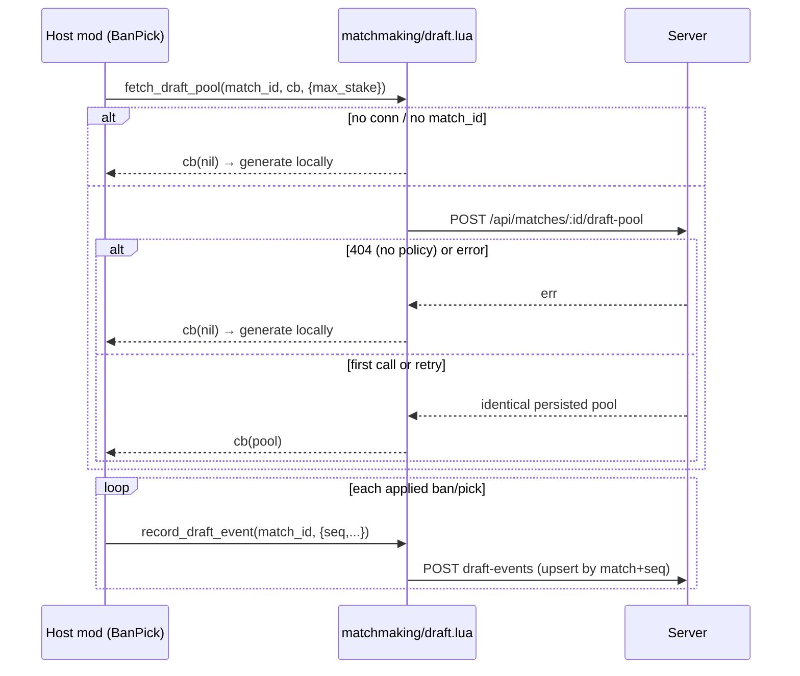

# 04 — Matchmaking (API layer)

> Source repo: `BalatroMultiplayerAPI`. Paths below are relative to that repo unless
> prefixed with `BalatroMultiplayer/` (the consumer mod, used for seam examples).

## 1. What this layer owns

This layer is the client half of ranked/queued play: joining and leaving server-side
matchmaking queues, holding a per-queue **handle** object that mods listen to, receiving
server pushes on the player's personal MQTT topic (`player/<id>/matchmaking`,
`api/matchmaking/state.lua:16-18`), and driving the automatic transition from
"match found" to "you are inside the matchmade lobby" (`LOBBY_READY`). It also owns two
cross-cutting conveniences every consumer mod gets for free: the shared "Queueing m:ss"
status timer (`api/matchmaking/queue_timer.lua`) and the queue guard that blocks
queue-conflicting actions (starting a run, creating/joining a lobby) behind a
leave-or-stay overlay (`api/matchmaking/queue_guard.lua` + `ui/queue_guard_overlay.lua`).
Finally it exposes the opt-in server-draft seam (`api/matchmaking/draft.lua`): fetching a
server-rolled draft pool and posting an audit trail of draft actions. It does **not** own
lobby mechanics (chapter on lobbies) or gameplay sync — after `LOBBY_READY` fires, the
lobby layer takes over.

## 2. Key files

| File | Role | The one thing to know |
|---|---|---|
| `api/matchmaking/api.lua` | Public entry points: `queue`, `queue_all`, `leave_all`, `queue_group`, ratings/leaderboard | `queue()` returns the handle **synchronously**; `QUEUED`/`ERROR` arrive later via callback (`api.lua:16-38`) |
| `api/matchmaking/state.lua` | Shared registry `MPAPI._internal.mm`: handles list, MQTT subscribe/unsubscribe, finders | State lives on `MPAPI._internal.mm`, not file-local upvalues, so the four files are load-order independent (`state.lua:3-8`) |
| `api/matchmaking/handle.lua` | The handle object: `on`/`_fire`, `leave`, `report_result`, `mark_started` | `handle:leave()` fires `'left'` **before** the server round-trip so UI resets even if the request fails (`handle.lua:43-46`) |
| `api/matchmaking/dispatch.lua` | Routes inbound `match_found` / `match_reconnect` / `match_resolved` messages; auto-joins the lobby | On `match_found`, all *other* handles are left client-side (their `LEFT` fires) — the server already dequeued them (`dispatch.lua:19-28`) |
| `api/matchmaking/queue_timer.lua` | Shared elapsed-time display; defines `MPAPI.matchmaking.is_queued()` | "Searching" = a handle with neither `_left` nor `match_id` (`queue_timer.lua:18-25`); the tick event is `no_delete` on purpose (`queue_timer.lua:43`) |
| `api/matchmaking/queue_guard.lua` | `guard_queued(replay)` gate + the `G.FUNCS.start_run` wrap | The replay closure must re-enter the caller's **own** guarded entry point, never a lower-level primitive (`queue_guard.lua:17-24`) |
| `ui/queue_guard_overlay.lua` | The leave-or-stay overlay and its two leave buttons | "Leave Queue & Continue" copies `mm.handles` before iterating — `leave()` mutates the list (`queue_guard_overlay.lua:88-96`) |
| `api/matchmaking/draft.lua` | Opt-in server-draft seam: `fetch_draft_pool`, `record_draft_event`, weekly cocktail | `callback(nil)` on **any** failure always means "generate locally" — never an error surface (`draft.lua:4-12`) |
| `networking/api_client/draft.lua` | HTTP calls behind the draft seam | `POST /api/matches/:id/draft-pool` is idempotent server-side; retries return the identical pool (`networking/api_client/draft.lua:3-5`) |

## 3. How it works

### a) Queue join, the handles registry, and one shared MQTT topic

`MPAPI.matchmaking.queue(opts)` refuses when not `CONNECTED`, ensures the single
per-player MQTT subscription exists, creates a handle, appends it to `mm.handles`, then
fires the HTTP join (`api/matchmaking/api.lua:4-39`):

```lua
mm.ensure_subscribed()
local handle = MPAPI.matchmaking._make_handle(opts.mod_id, opts.game_mode)
mm.handles[#mm.handles + 1] = handle
conn.api:queue_matchmaking(conn.jwt_token, { ... }, function(err, data)
    if err then ... mm.remove_handle(handle); handle:_fire(MPAPI.MatchmakingEvent.ERROR, err); return end
    if mm.queue_timer then mm.queue_timer.start() end
    handle:_fire(MPAPI.MatchmakingEvent.QUEUED, data and data.position)
end)
return handle
```

All queues share one subscription to `player/<id>/matchmaking`; the payload handler must
take the **second** argument — the client invokes handlers as `(topic, payload)`, and
taking only the first silently dropped every message (`state.lua:51-62`). The
subscription is torn down by `mm.unsubscribe_if_empty()` only when the last handle is
removed (`state.lua:67-84`). `queue_all` is a plain loop over `queue`
(`api.lua:42-51`); `queue_group` is `queue` — the server detects the lobbyCode from the
session (`api.lua:86-95`).

### b) `match_found` → auto-join → `LOBBY_READY`

Dispatch finds the handle by `(modId, gameMode)`; if none exists the message is logged
and **dropped** (`dispatch.lua:8-16`). On a hit it stamps `handle.match_id`, marks every
other handle `_left` (firing their `LEFT` events), collapses `mm.handles` to just the
matched one, fires `MATCH_FOUND`, then auto-joins (`dispatch.lua:18-48`):

```lua
local lobby = MPAPI.join_lobby(msg.modId, msg.lobbyCode)
if lobby then
    lobby:on(MPAPI.LobbyEvent.CONNECTED, function()
        matched:_fire(MPAPI.MatchmakingEvent.LOBBY_READY, lobby)
    end)
    lobby:on(MPAPI.LobbyEvent.ERROR, function(err)
        matched:_fire(MPAPI.MatchmakingEvent.ERROR, 'lobby join failed: ' .. tostring(err))
    end)
```

So `LOBBY_READY` is the event consumers build their match UI on — it guarantees a live,
connected lobby object. `MATCH_FOUND` alone does not. A `match_reconnect` message takes a
parallel path, synthesizing a fresh handle (marked `_reconnected`) when none survives
(`dispatch.lua:51-66`). `MATCH_RESOLVED` finds the handle **by match_id**, fires
`MATCH_RESOLVED` with the ratings payload, and only then removes the handle
(`dispatch.lua:68-74`) — which is why a matched handle must stay in `mm.handles` for the
entire match (see invariants).

### c) The queue guard and the replay contract

`guard_queued(replay)` is a shared gate: if `is_queued()`, it stashes `replay` as
`mm.pending_action`, opens the overlay, and returns `true` so the caller aborts
(`queue_guard.lua:25-33`). The API itself uses it to wrap `G.FUNCS.start_run`, the single
vanilla chokepoint every "enter a run" flow funnels through (`queue_guard.lua:37-51`):

```lua
local _start_run_ref = G.FUNCS.start_run
G.FUNCS.start_run = function(e, args)
    if MPAPI.matchmaking.guard_queued(function() return G.FUNCS.start_run(e, args) end) then
        return
    end
    return _start_run_ref(e, args)
end
```

**The contract:** the replay closure must re-enter the caller's *own complete entry
point* — here the wrapper itself, not `_start_run_ref` — so the gate re-checks on the way
through (`queue_guard.lua:45-47`). If the leave didn't take, it re-blocks instead of
proceeding. The *why* is visible in the consumer:
`BalatroMultiplayer/pvp_api/flow.lua:42,78` replays `MP.pvp_join_lobby(code)` /
`MP.pvp_create_private_lobby(...)`, never `MPAPI.join_lobby` — replaying the primitive
would join/allocate server-side (the host sees you) but skip the consumer's post-join
setup (`setup_lobby_mirror` + the CONNECTED UI transition), stranding the player on the
menu (`BalatroMultiplayer/pvp_api/flow.lua:73-80`, `queue_guard.lua:17-24`). The
overlay's "Leave Queue & Continue" button leaves every handle (over a shallow copy,
because `leave()` mutates `mm.handles`), dismisses, then clears and invokes
`mm.pending_action` (`ui/queue_guard_overlay.lua:90-116`).

### d) The queue-time display

`mm.queue_timer.start()` is idempotent — `queue_all`'s concurrent joins share one timer
and the start time is stamped only on the first call (`queue_timer.lua:67-76`). A
self-rescheduling 0.25 s event pushes `"Queueing m:ss"` into the account panel via
`MPAPI.set_connection_status` and self-terminates (clearing the status) once
`any_searching()` is false (`queue_timer.lua:32-61`). The event is created with
`no_delete = true` (`queue_timer.lua:43`): `Game:start_run` / `G:delete_run` call
`G.E_MANAGER:clear_queue()`, and since `schedule_tick` is only ever re-armed from inside
a tick, a deleted tick would freeze the status text and leave `_active` stuck true for
the session. `any_searching()` doubles as the public `MPAPI.matchmaking.is_queued()`
(`queue_timer.lua:90-92`).

### e) The draft seam (opt-in, fail-open to local)

`fetch_draft_pool(match_id, cb, opts)` calls `POST /api/matches/:id/draft-pool` and
invokes `cb(nil)` on *any* failure — no connection, no match id, no draft policy for the
queue (server 404), transport error — where nil always means "generate the pool locally"
(`draft.lua:16-33`, contract comment `draft.lua:4-12`). The endpoint is **idempotent**
server-side: the first call rolls and persists; every retry/reconnect returns the
identical pool, and the optional `max_stake` cap filters stakes for compat mods
(`networking/api_client/draft.lua:3-17`). `record_draft_event(match_id, { seq, action,
key, stake })` is a fire-and-forget audit post; `event.seq` dedups transport retries via
a server upsert on `(match, seq)`, and failures are logged, never surfaced
(`draft.lua:52-62`, `networking/api_client/draft.lua:33-44`). The consumer feeds it a
monotonically increasing seq per applied ban/pick
(`BalatroMultiplayer/pvp_api/draft_pool.lua:278-283`).

## 4. Main flows

### Queue → match found → lobby ready → resolved

```mermaid
sequenceDiagram
    participant Mod as Consumer mod
    participant API as matchmaking/api.lua
    participant MQTT as player/<id>/matchmaking
    participant D as dispatch.lua
    participant Srv as Server
    Mod->>API: queue{mod_id, game_mode}
    API->>API: ensure_subscribed + make handle
    API-->>Mod: handle (sync return)
    API->>Srv: queue_matchmaking (HTTP)
    Srv-->>API: ok {position}
    API->>Mod: handle QUEUED (+ queue_timer.start)
    Srv-->>MQTT: {type: match_found, matchId, lobbyCode}
    MQTT->>D: dispatch(msg)
    D->>D: stamp match_id, LEFT all other handles
    D->>Mod: handle MATCH_FOUND
    D->>Srv: MPAPI.join_lobby(lobbyCode)
    Srv-->>D: LobbyEvent.CONNECTED
    D->>Mod: handle LOBBY_READY(lobby)
    Note over Mod,Srv: ...match plays out; mod calls handle:report_result...
    Srv-->>MQTT: {type: match_resolved, ratings}
    MQTT->>D: dispatch(msg)
    D->>Mod: handle MATCH_RESOLVED(ratings)
    D->>D: remove_handle → unsubscribe_if_empty
```

### Queue guard: blocked action → leave & replay

```mermaid
sequenceDiagram
    participant P as Player
    participant EP as Guarded entry point (start_run / pvp_join_lobby)
    participant G as guard_queued
    participant O as queue_guard_overlay
    P->>EP: click (while searching)
    EP->>G: guard_queued(replay = re-enter EP)
    G->>G: is_queued() == true → stash replay
    G->>O: open overlay, return true (EP aborts)
    P->>O: "Leave Queue & Continue"
    O->>O: leave_all_handles() (copy first; each fires 'left')
    O->>EP: pending_action() → re-enters EP
    EP->>G: guard_queued again
    G-->>EP: is_queued() == false → return false
    EP->>EP: full flow proceeds (join + mirror + UI)
```

### Draft pool fetch (fail-open)



## 5. Invariants & gotchas

- **A matched handle must stay in `mm.handles` until `MATCH_RESOLVED`.** Resolution is
  looked up by `match_id` (`dispatch.lua:68-74`); if the consumer calls `handle:leave()`
  early, the ratings event is dropped and the MQTT subscription/re-queue state gets
  confused. The consumer only leaves on lobby exit (`BalatroMultiplayer/pvp_api/lobby_bridge.lua:269-275`).
- **`LOBBY_READY`, not `MATCH_FOUND`, is the "start UI" signal.** `MATCH_FOUND` fires
  before the lobby is joined; join can fail and surface as handle `ERROR`
  (`dispatch.lua:30-48`).
- **Replay closures must re-enter the guarded entry point**, never a primitive —
  otherwise the server-side action happens while the client-side setup is skipped
  (`queue_guard.lua:17-24`, `BalatroMultiplayer/pvp_api/flow.lua:37-44,73-80`).
- **"Searching" is derived, not a flag:** a handle with no `_left` and no `match_id`
  (`queue_timer.lua:18-25`). `leave_all` sets `_left` on old handles but replaces the
  list wholesale and resets `mm.subscribed` (`api.lua:61-69`) — it does *not* fire
  per-handle `'left'` events, unlike `handle:leave()` (`handle.lua:37-46`).
- **The timer tick must stay `no_delete`** (`queue_timer.lua:38-43`): a run start/end
  clears the event queue, and the tick chain never re-arms from outside itself.
- **The MQTT handler signature is `(topic, payload)`** — payload is the second arg;
  regressing this drops every matchmaking message silently (`state.lua:51-54`).
- **Iterating `mm.handles` while leaving mutates the list** — always copy first
  (`ui/queue_guard_overlay.lua:88-96`, via `mm.remove_handle`'s `table.remove`,
  `state.lua:86-94`).
- **Unknown `match_found` messages are dropped, not queued** (`dispatch.lua:9-16`) — a
  race between leave and match assignment resolves as a warn-log, not a lobby join.
- **Draft nil means local, always.** Never treat `cb(nil)` as an error to retry; the
  fallback *is* the design for servers without draft policies (`draft.lua:4-12`).

## 6. Review lens

- Any new queue-conflicting UI action (buttons that start runs, create/join lobbies,
  switch profiles into a run) must call `guard_queued` with a replay that re-enters the
  **complete** entry point — reject replays of `MPAPI.join_lobby`/`MPAPI.create_lobby`
  or of the saved raw reference (`_start_run_ref`-style) that skips the gate.
- Changes to handle lifecycle: does the handle still survive from `match_found` to
  `MATCH_RESOLVED`? Does every removal path go through `mm.remove_handle` so
  `unsubscribe_if_empty` runs (`state.lua:86-94`)?
- Events on handles are fired inside `pcall` (`handle.lua:24-35`) — listener errors are
  logged, not thrown. Don't rely on a listener exception to abort a flow.
- New timer/overlay events created near run boundaries: check `no_delete` and whether
  the chain re-arms after `clear_queue()` (`queue_timer.lua:38-43` is the precedent).
- Draft-seam changes: preserve the nil-means-local contract and the idempotency
  assumptions — pool fetch must be safe to retry (identical pool), events must carry a
  stable `seq` (server dedup key, `networking/api_client/draft.lua:33-35`).
- Anything touching `mm.*` state: it must live on `MPAPI._internal.mm` with defensive
  `or {}` init (`state.lua:3-8`), never as a file-local upvalue shared across files, and
  must tolerate any load order of the matchmaking files.
