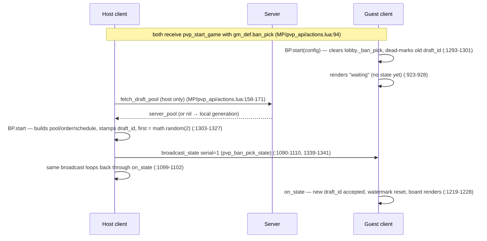
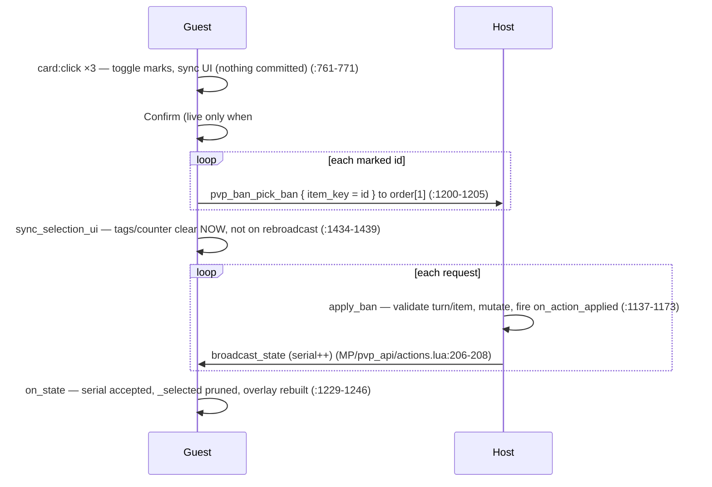
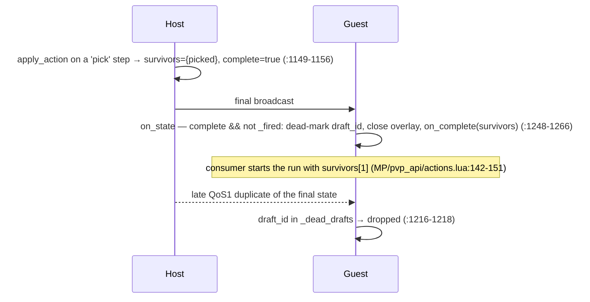

# 05 — The Ban-Pick Draft Engine

> Source lives in the **BalatroMultiplayerAPI** repo (branch `dev-local`) unless prefixed otherwise.
> `MP/...` paths are in the **BalatroMultiplayer** mod repo (the consumer).

## What this layer owns

`MPAPI.BanPick` is a generic, host-authoritative, turn-based draft engine: the host builds the candidate pool and turn schedule, validates every ban/pick, and rebroadcasts the *full* canonical state after each change; guests only render broadcasts and *request* actions (`api/ban_pick.lua:1-24`). It owns the draft state shape, a per-draft staleness guard (draft_id epochs + serial watermarks), a pure select-then-confirm selection model with a blind Random mode, and the entire draft UI — deck tiles, Selected tags, the Confirm/Random row, hover popups with stake/composition detail, and on-screen popup clamping. Networking itself is *not* owned here: the two wire messages are consumer-defined ActionTypes whose handlers delegate straight back into the engine (`api/ban_pick.lua:20-24`, `MP/pvp_api/actions.lua:184-210`).

## Key files

| File | Role | The one thing to know |
|---|---|---|
| `api/ban_pick.lua` | The whole engine: state, authority, guard, selection, UI (~1440 lines) | One module, three strata — pure helpers, host authority + networking, UI. Module-locals (`_selected`, `_current_draft_id`, ...) survive overlay rebuilds by design (`api/ban_pick.lua:36-63`) |
| `MP/pvp_api/actions.lua` | Consumer wiring: draft config, `pvp_ban_pick_state`/`pvp_ban_pick_ban` ActionTypes | The engine never registers ActionTypes; the consumer's `on_receive` handlers are one-liners into `on_state`/`apply_ban` (`MP/pvp_api/actions.lua:184-210`) |
| `dev/test_banpick_selection.lua` | Headless luajit tests for the selection layer, confirm handlers, stake column | Runs the *real* module against stub `G`/`MPAPI` — `dofile('api/ban_pick.lua')` with fakes (`dev/test_banpick_selection.lua:18-43`) |
| `dev/test_banpick_events.lua` | Tests for `on_action_applied` events + the staleness guard | Contains the two canonical regressions: key@stake twin-ban and the cross-host serial wedge (`dev/test_banpick_events.lua:103-134`, `267-285`) |
| `dev/test_banpick_popup_clamp.lua` | Pure clamp-geometry tests | Quarter-unit fixtures so identities hold under exact `==` (`dev/test_banpick_popup_clamp.lua:42-45`) |
| `dev/shots.lua` | Visual scenarios for the DevTools screenshot harness | Inert unless DevTools runs it; documents the nil-actor gotcha in a comment (`dev/shots.lua:1-24`) |

## How it works

### 1. State shape, item identity, and actor resolution

The host constructs the entire draft state at `BP.start` (`api/ban_pick.lua:1312-1322`):

```lua
lobby._ban_pick = {
    draft_id = draft_id,           -- host id + os.time() + session counter (:1310)
    pool = pool,                   -- items: 'b_red' or { key='b_red', stake=4, ... }
    banned = {},                   -- set keyed by item ID
    order = build_order(lobby),    -- order[1] is ALWAYS the host (:123-136)
    first = math.random(2),        -- which order slot is logical actor 1
    schedule = schedule,           -- { { actor=1|2, action='ban'|'pick', count=N }, ... }
    sched_index = 1,
    sched_remaining = schedule[1] and schedule[1].count or 0,
    complete = false,
}
```

Item **identity** is `key@stake` for tuple items, the bare key for strings (`api/ban_pick.lua:83-91`). This exists because tuple pools may repeat a deck at different stakes — banning Red@White must not ban Red@Gold (regression pinned at `dev/test_banpick_events.lua:103-134`). IDs travel opaquely through the wire's `item_key` parameter and the selection UI.

Actor resolution decouples routing from turn order: `order[1]` is always the host (so a guest sends bans to `s.order[1]`, `api/ban_pick.lua:1203`), while `state.first` decides which slot plays as logical actor 1:

```lua
local function resolve_actor(state, actor)
    local slot = (actor == 1) and (state.first or 1) or (3 - (state.first or 1))
    return state.order[slot]
end
```
(`api/ban_pick.lua:138-141`)

**The nil-actor gotcha:** the condition is `actor == 1`, so *anything else* — including a `nil` or missing `actor` in a schedule step — silently resolves as actor 2. The shot suite documents the symptom: "a nil actor resolves as actor 2 — without it every scene renders as the OPPONENT's turn" (`dev/shots.lua:21-24`). Schedules must always spell out `actor = 1|2`.

### 2. Host-authoritative apply → broadcast → on_state loop

All mutation happens in one host-side function. `apply_action` rejects anything off-turn, unknown, already-banned, or post-complete, then either records a ban and advances the schedule, or (on a `pick` step) crowns the winner and completes (`api/ban_pick.lua:1137-1173`):

```lua
if current_actor_id(s) ~= from_player_id then return false end
if not item_for_id(s, id) or s.banned[id] then return false end
```

`BP.request_ban` is the symmetric client entry: the host applies + broadcasts directly; a guest only sends the consumer's ban ActionType to `s.order[1]` (`api/ban_pick.lua:1180-1206`). The consumer's host handler is the closing link: `apply_ban(...) and broadcast_state(...)` (`MP/pvp_api/actions.lua:201-210`). Crucially, the host's own broadcast **loops back** through `on_state` and replaces `lobby._ban_pick` — everyone, host included, renders the broadcast state, which is why the serial must ride *on* the state (`api/ban_pick.lua:1099-1102`).

After each applied action the host fires `config.on_action_applied(seq, player_id, action, key, stake)` under `pcall` — a consumer bug must never break a live draft; `seq` increments from 0 as the server-side dedup key (`api/ban_pick.lua:1117-1129`).

### 3. The staleness guard: draft_id epochs + per-draft serial watermark

MQTT QoS1 can re-deliver and reorder; a late duplicate of an *old* draft's final broadcast must neither render a stale board nor complete the *new* draft. The design (`api/ban_pick.lua:46-63`):

- every draft gets a unique `draft_id` (`host_id#os.time()#counter`, `api/ban_pick.lua:1309-1311`); every broadcast stamps an incrementing `serial` on the state and advances the host's own watermark at stamp time (`api/ban_pick.lua:1103-1108`);
- `on_state` drops anything whose `draft_id` is in the dead set; a *new* `draft_id` supersedes the old (dead-marks it) and **resets the watermark to 0**; within a draft, `serial < _last_serial` drops, `==` re-applies (reconnect refresh / QoS1 re-delivery of the current state) (`api/ban_pick.lua:1215-1234`);
- completion dead-marks the draft_id (`api/ban_pick.lua:1248-1252`); `BP.start` clears `lobby._ban_pick` and dead-marks the previous draft — on guests this prevents the old *complete* state rendering as a live board during the host's async pool fetch (`api/ban_pick.lua:1293-1301`);
- a state with no `draft_id` (older host build) is accepted unconditionally (`api/ban_pick.lua:59`, `1215`).

Serials are **never compared across drafts or hosts** — the per-draft watermark is precisely what fixes the cross-host wedge where a guest who saw host A's serial 8 would reject host B's fresh serial 1 (regression: `dev/test_banpick_events.lua:267-285`).

### 4. Selection layer (pure) and blind Random

Select-then-confirm is a pure model over module-local `_selected`, exposed for headless tests via `BP._selection` (`api/ban_pick.lua:274-294`): `needed` (a pick step is always 1; a ban step wants `sched_remaining`, `api/ban_pick.lua:193-205`), `toggle` (add / remove / swap-at-cap-1 / block-at-cap-N, `api/ban_pick.lua:219-238`), `prune` (drops marks a broadcast invalidated, `api/ban_pick.lua:242-251`), and `randomize` with an injectable RNG (`api/ban_pick.lua:256-271`). `on_state` prunes the selection instead of clearing it, so surviving marks re-apply to the rebuilt tiles (`api/ban_pick.lua:1239`, `1017-1019`).

Random is a **blind commit**: arming clears manual marks and reveals nothing (counter reads `?/N`); the actual roll happens only inside Confirm, so there is nothing to peek at or reroll-fish for (`api/ban_pick.lua:41-44`, `1385-1396`, `1412-1417`). A short roll (eligible survivors < needed) commits *nothing* — a partial batch would exhaust the pool mid-step and wedge the draft (`api/ban_pick.lua:1418-1424`).

## Main flows

### Draft start (matchmaking with server pool)



### A guest's ban turn (count=3 step)



### Completion and the dead-draft guard



## Invariants & gotchas

- **Only the host mutates.** Guests never touch `lobby._ban_pick` except by replacing it wholesale in `on_state`. Any PR that mutates draft state on a guest path is wrong by construction.
- **`order[1]` is the host — always.** Guest ban routing depends on it (`api/ban_pick.lua:121-136`, `1203`). Randomizing who *acts* first is `state.first`'s job, never `order`'s.
- **Schedule steps need explicit `actor = 1|2`.** `resolve_actor` treats anything ≠ 1 (including nil) as actor 2 (`api/ban_pick.lua:138-141`, `dev/shots.lua:21-24`).
- **Identity is `item_id`, not `item_key`.** Bans, selection, `card.mp_item_id`, and the wire all carry `key@stake` for tuples; comparing bare keys resurrects the twin-ban bug (`api/ban_pick.lua:77-91`, `755-757`).
- **Serials never cross draft boundaries.** Guard changes must preserve: dead-set drop, watermark reset on new draft_id, `<` (not `<=`) drop, equal-serial re-apply, no-draft_id acceptance (`api/ban_pick.lua:1215-1234`). The serial rides *on the state* because the host's loopback replaces `lobby._ban_pick` (`api/ban_pick.lua:1099-1102`).
- **The overlay is rebuilt on every broadcast; module-locals are the continuity.** `_selected`/`_sel_ui`/`_areas` deliberately live outside the overlay (`api/ban_pick.lua:36-40`). Storing UI state on nodes loses it every turn.
- **`config.button` must exist at UIBox build time.** `UIElement:set_values` only arms clicking for nodes that *have* `config.button` when built; the per-frame check then gates by nulling it (`api/ban_pick.lua:1032-1035`, `1355-1363`). A "cleaner" conditional button definition silently produces a dead button.
- **DynaText/UIBox construction is a side effect.** `localize{type='descriptions'}` self-registers live objects into `G.I.MOVEABLE` at construction — anything built but not placed draws unparented at the screen origin. Hence lazy popup-row builders (`api/ban_pick.lua:613-617`) and the two-phase stake column: `gather` runs every fallible call under `pcall`, parking node tables in `gathered.line_sets` *before* the localize that fills them so a mid-gather failure can `release` everything; `build` is pure assembly that cannot fail (`api/ban_pick.lua:390-401`, `821-830`).
- **Popup clamping has two mechanisms because Card anchors realign every frame.** Vanilla `Card:move` re-calls `set_alignment` each frame, wiping both `lr_clamp` and the offset — so for tile popups only the per-frame `move` wrapper holds, and it clamps both axes itself; the one-shot offset mutation works only for static UIElement anchors like the badge (`api/ban_pick.lua:555-611`, esp. `580-587`). The pure decision `popup_clamp_y` applies bottom edge first so the top edge wins for taller-than-room popups (`api/ban_pick.lua:540-548`).
- **Popup insert index must be clamped.** The vanilla `card_h_popup` pattern assumes pre-populated `nodes`; here `nodes` starts empty, so inserting at 2 would leave `nodes[1] = nil` — an array hole every `ipairs` consumer stops at (`api/ban_pick.lua:839-844`).
- **Drag disable must run after ALL emplaces.** `CardArea:emplace → set_ranks` re-enables drag on every card already in the area; a per-tile disable survives only on the row's last tile (`api/ban_pick.lua:997-1007`).
- **Tile hover shows compact composition on purpose.** Full per-deck effect boxes live only in the top-of-panel cocktail badge popup, laid out in side-by-side columns — a tile-anchored tooltip tall enough for three deck descriptions inevitably covers the tile row it points at (`api/ban_pick.lua:791-796`, `690-693`, `854-858`).

## Review lens

- **Authority:** does any changed path let a guest mutate `lobby._ban_pick`, or apply an action without passing `apply_action`'s turn/item/complete guards (`api/ban_pick.lua:1137-1147`)? Does every host-side state change end in `broadcast_state`?
- **Guard integrity:** if `on_state`, `broadcast_state`, or `BP.start` changed, walk all five staleness rules (`api/ban_pick.lua:1215-1234`, `1293-1301`) and run `luajit dev/test_banpick_events.lua` — the cross-host wedge and old-final-completes-new-draft regressions live there.
- **Identity discipline:** any new comparison, table key, or wire field involving pool items must use `item_id` (key@stake), not `item_key` (`api/ban_pick.lua:70-91`). Grep the diff for `.key` on pool items.
- **UI object lifecycle:** does new code construct `DynaText`/`UIBox`/`localize{type='descriptions'}` outside an immediately-placed hover, or add a fallible call to `build_stake_column` (must stay pure — fallible work belongs in `gather_stake_column`)?
- **Build-time button pattern:** new gated buttons must declare `config.button` in the definition and gate via a per-frame `func` check nulling it — not conditionally omit the field (`api/ban_pick.lua:1032-1044`).
- **Tests ride along:** selection/guard/geometry changes are covered headlessly (`luajit dev/test_banpick_selection.lua`, `..._events.lua`, `..._popup_clamp.lua`); UI-visible changes get or update a scenario in `dev/shots.lua` (they version with the code, not the tools repo — `dev/shots.lua:1-7`).
