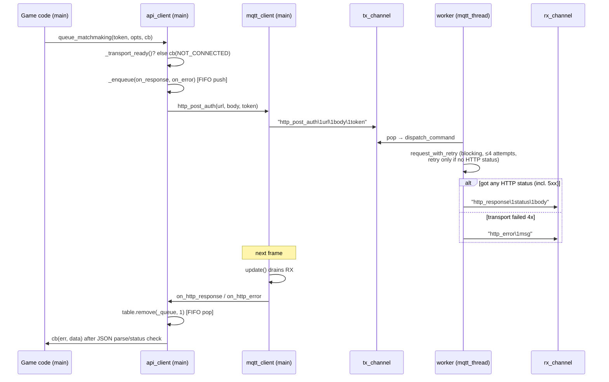
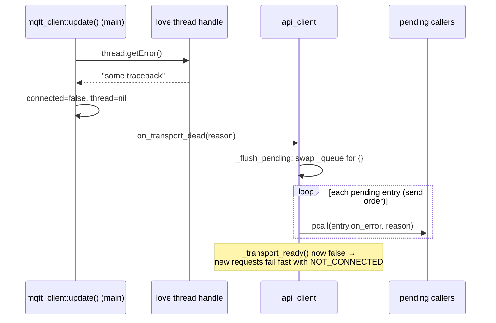

# 06 — Transport: MQTT worker + api_client

> Source tree: `BalatroMultiplayerAPI/networking/` and the vendored luamqtt in `BalatroMultiplayerAPI/lib/mqtt/`. All file:line references below are relative to the `BalatroMultiplayerAPI` repo.

## What this layer owns

This layer is the only code that touches the network. It owns a single dedicated Love2D worker thread (`networking/mqtt_thread.lua`) that runs both the MQTT connection (vendored luamqtt, `lib/mqtt/`) and every HTTPS request the mod makes; the main thread talks to it exclusively through two unnamed `love.thread` channels using `\1`-separated string commands (`networking/mqtt_client.lua:14`). On top of that raw transport sits `networking/api_client/` — the typed HTTP endpoint methods (auth, lobby, matchmaking, draft, account) plus the FIFO response-correlation queue that matches each HTTP response back to its caller. One terminology correction worth internalizing before reviewing: **HTTP does not travel over MQTT**. HTTP requests are plain HTTPS performed *on the MQTT worker thread* (`mqtt_thread.lua:89-191`); MQTT topics carry only pub/sub game traffic (`lobby/{code}/...`, `player/{id}/account/#`). The two share a thread and a channel pair — nothing else.

## Key files

| File | Role | The one thing to know |
|---|---|---|
| `networking/mqtt_client.lua` | Main-thread handle: spawns the worker, serializes commands, pumps events via `update()` | `update()` must run every frame (wired in `api/connection/lifecycle.lua:52-57`) or no callback ever fires |
| `networking/mqtt_thread.lua` | The worker: luamqtt sync loop + all HTTPS (OpenSSL FFI) + bounded retry | Runs requests **serially and blocking** — this ordering is what makes FIFO correlation sound |
| `networking/api_client/client.lua` | FIFO queue, response router, dead-transport flush, JSON callback builders | Read the invariant comment at `client.lua:64-75` before touching anything here |
| `networking/api_client/{auth,account,lobby,matchmaking,draft}.lua` | One method per REST endpoint, all following guard → enqueue → send | `lobby.lua` still contains three legacy single-slot handlers that bypass the FIFO (see gotchas) |
| `networking/api_client.lua` | Loader; `client.lua` must load first (`api_client.lua:5`) | Endpoint files extend the table `client.lua` created — load order is load-bearing |
| `networking/connection.lua` | Auth state machine; bridges api_client (HTTP auth) to mqtt_client (broker connect) | Pushes the broker `connect` command *directly* onto `tx_channel` with JWT credentials (`connection.lua:372-384`) |
| `networking/mqtt_thread.lua` + `networking/openssl_ffi.lua` | TLS for both MQTT (8883) and HTTPS | HTTPS forces IPv4 DNS via `socket.dns.toip` to dodge IPv6 `ENETUNREACH` (`mqtt_thread.lua:102-106`) |
| `lib/mqtt/*` | Vendored luamqtt (protocol 4/5, ioloop, connectors) | Treated as a library; the worker monkey-patches `_receive_packet` so socket timeouts are non-fatal (`mqtt_thread.lua:42-52`) |

## How it works

### 1. The channel protocol: strings joined by `\1`

Every main→worker command and worker→main event is one string, fields joined by SOH (`\1`), chosen because it can never appear in topics or JSON (`mqtt_client.lua:14`). The worker's main loop drains all pending commands non-blocking, then drives one MQTT sync iteration:

```lua
-- mqtt_thread.lua:417-424
while running do
	-- 1. Drain all pending commands (non-blocking)
	while true do
		local cmd = tx_channel:pop()
		if not cmd then
			break
		end
		dispatch_command(cmd)
```

`dispatch_command` (`mqtt_thread.lua:381-412`) routes `connect` / `subscribe` / `publish` / `http_post` / `http_post_auth` / `http_put_auth` / `http_get_auth` / `http_delete_auth` / `http_delete_with_body_auth` / `disconnect` / `shutdown`. On the main side, `mqtt_client:update()` (`mqtt_client.lua:311-396`) drains `rx_channel` each frame and fans events out to `on_connect`, `message_handlers` (topic-wildcard matched, `mqtt_client.lua:73-81`), `on_http_response`, `on_http_error`, and `on_error`. Because keepalive is the worker's job (it sends PINGREQ itself when `keep_alive` elapses, `mqtt_thread.lua:444-453`), the main thread's only hard obligation is calling `update()`.

### 2. HTTP requests run serially on the worker — correlation is positional

There are no request IDs. An HTTP call is: main thread pushes e.g. `http_post_auth\1url\1body\1token` (`mqtt_client.lua:218-231`); the worker pops it and runs `request_with_retry` **synchronously, blocking the worker** until it resolves (`mqtt_thread.lua:232-253`); each handler then pushes back *exactly one* event — `http_response` (status + body) or `http_error`:

```lua
-- mqtt_thread.lua:261-265
local function handle_http_post_auth(url, body, token)
	local status, resp = request_with_retry('POST', url, body, { ['Authorization'] = 'Bearer ' .. token })
	if status then push_event('http_response', tostring(status), resp)
	else push_event('http_error', tostring(resp)) end
end
```

Retry policy: only *transport-level* failures (nil status — no HTTP status was ever received, so the request almost certainly never completed server-side) are retried, max 4 attempts with backoff `{0.3, 0.8, 1.5}`s; a real HTTP status, even 5xx, is returned as-is and never retried (`mqtt_thread.lua:224-253`). The backoff window is deliberately bounded because it blocks the worker and therefore MQTT keepalive (`mqtt_thread.lua:226-227`).

### 3. The FIFO response queue (api_client/client.lua)

Each endpoint method calls `_enqueue(on_response, on_error)` immediately before pushing its command, so queue order equals send order (`client.lua:98-103`). The router installed on the transport pops the *front* entry for every inbound event:

```lua
-- client.lua:76-84
function api_client:_install_router()
	self.mqtt.on_http_response = function(status, body)
		local entry = table.remove(self._queue, 1)
		if entry then
			entry.on_response(status, body)
		else
			MPAPI.sendWarnMessage('api_client: http_response with no pending request -- response-queue desync')
		end
	end
```

Positional matching is sound because of three invariants, all documented in code (`client.lua:64-75`):

1. **Ordering** — the worker runs requests serially and blocks on each, so responses return in send order.
2. **One-event-per-request** — every `handle_http_*` pushes exactly one response OR error; `request_with_retry` is bounded, so retries never produce extra events.
3. **No in-place transport swap** — `self.mqtt` is set once in `new()` (`client.lua:3-20`); reconnect builds a *fresh* api_client rather than re-pointing an old one, so a queue never outlives its transport.

The empty-queue branch is a tripwire, not error handling: a response with nothing pending should be impossible, so it warns loudly instead of failing silently (`client.lua:74-75`). The FIFO replaced an older single-shared-slot design where two overlapping requests clobbered each other's handler — the first response ran the wrong parser and the second was dropped (history preserved at `client.lua:7-15`).

Two callback builders wrap `_enqueue`: `_setup_http_callback` requires a `token` field in the body (auth endpoints, `client.lua:107-132`); `_setup_json_callback` is the generic JSON path handling 204/empty-body/non-2xx (`client.lua:135-168`). Every endpoint method starts with the same guard:

```lua
-- e.g. matchmaking.lua:3-8
function api_client:queue_matchmaking(token, opts, callback)
	if not self:_transport_ready() then
		callback(MPAPI.make_error(MPAPI.ErrorKind.NOT_CONNECTED, 'MQTT thread not running'), nil)
		return
	end
	self:_setup_json_callback(callback)
```

`_transport_ready()` checks `self.mqtt and self.mqtt.tx_channel and self.mqtt.thread` (`client.lua:42-44`). The `thread` check matters: after a worker crash the channel object still exists, but nothing drains it — queueing into it would hang the caller forever.

### 4. Dead-worker detection and the pending flush

Every `update()` tick also polls thread health. If the worker crashed, nobody will ever drain `tx_channel` or answer in-flight requests, so the transport declares itself dead:

```lua
-- mqtt_client.lua:380-395
if self.thread then
	local err = self.thread:getError()
	if err then
		if self.on_error then
			self.on_error('Thread crashed: ' .. tostring(err))
		end
		self.connected = false
		self.thread = nil
		if self.on_transport_dead then
			self.on_transport_dead('MQTT worker thread crashed: ' .. tostring(err))
		end
	end
end
```

`on_transport_dead` is wired by `_install_router` to `_flush_pending` (`client.lua:93-95`), which swaps in an empty queue and fires every pending entry's `on_error` under `pcall` (`client.lua:50-59`) — so each caller gets its error callback and fallback paths engage instead of hanging. Setting `self.thread = nil` also makes `_transport_ready()` false, so *subsequent* requests fail fast with `NOT_CONNECTED` instead of enqueueing into a dead channel.

### 5. Reconnect = rebuild everything, never re-point

`MPAPI.reconnect()` is literally `disconnect()` then `connect()` with the same opts (`api/connection/lifecycle.lua:159-163`). `MPAPI.connect` constructs a **fresh** `mqtt_client.new(...)` (`lifecycle.lua:115-119`) and a **fresh** `api_client.new(mqtt, base_url)` with a new empty `_queue` (`lifecycle.lua:121`). Channels are unnamed per-instance (`mqtt_client.lua:104-106`), so the old worker's leftover events can never bleed into the new instance. This is invariant #3 above expressed as architecture: the correlation queue's lifetime is bound to the transport's lifetime, so reconnecting can never desync responses.

## Main flows

### HTTP request/response (happy path + transport failure)



### Worker crash → pending flush



### Connect / auth → broker connect

```mermaid
sequenceDiagram
    participant L as lifecycle.lua (MPAPI.connect)
    participant CN as connection.lua
    participant API as api_client (fresh)
    participant MC as mqtt_client (fresh)
    participant W as worker
    L->>MC: mqtt_client.new(broker, port, secure)
    L->>API: api_client.new(mqtt, base_url)  [empty _queue]
    L->>CN: connection.new{...}; connect()
    CN->>MC: start_thread() (loads mqtt_thread.lua via NFS)
    CN->>API: authenticate_refresh / authenticate_steam (HTTP)
    API-->>CN: cb(nil, {token, player, refreshToken})
    CN->>MC: tx_channel:push("connect\1...\1player_id\1jwt")
    W->>W: mqtt.client + start_connecting, settimeout 0.05
    W-->>MC: "connected" event
    MC->>CN: on_connect → subscribe player/{id}/account/#
```

(Auth flow: `connection.lua:100-175` and `connection.lua:337-385`; the MQTT username is the player id and the password is the JWT, `connection.lua:377-381`.)

## Invariants & gotchas

- **The three FIFO invariants** (`client.lua:64-75`) are the contract of this layer: serial worker, one event per request, queue-lifetime-follows-transport. Break any one and *every later response misroutes* — not just the offending request.
- **Every send must go through `_enqueue`; every enqueue must be followed by exactly one send.** An enqueue without a send (or a send that skips `_enqueue`) shifts the FIFO permanently. The endpoint files' guard→enqueue→send shape is the pattern to preserve.
- **Legacy single-slot handlers still exist in `lobby.lua`** — `set_lobby_metadata` (`lobby.lua:43-79`), `enable_chat` (`lobby.lua:88-124`), and `send_chat_message` (`lobby.lua:133-164`) assign `self.mqtt.on_http_response` directly and use a shared `self.pending_callback` slot. This *overwrites the FIFO router*: if a FIFO request is in flight when one of these fires, the FIFO entry's response gets consumed by the single-slot handler and the queue desyncs. They work today only because their call sites don't overlap FIFO traffic; any PR increasing concurrency around them should migrate them to `_enqueue` instead.
- **The worker blocks on HTTP.** A slow request (up to ~15s socket timeout × 4 attempts + backoff) stalls MQTT I/O and message delivery on the same thread. Don't add unbounded sleeps/retries to `mqtt_thread.lua`; the bounded backoff comment (`mqtt_thread.lua:226-227`) exists precisely to protect keepalive.
- **Callbacks run on the main thread, during `update()`.** Nothing in `api_client` is called from the worker; there is no locking anywhere because the *only* shared state is the two channels. Never call `api_client`/`mqtt_client` methods from worker code, and never do blocking I/O in a callback.
- **Retry semantics are deliberately asymmetric:** nil status (no response received) → retry, because the request almost certainly never completed server-side; any real status, even 500, → no retry (`mqtt_thread.lua:224-232`). Endpoints that *are* retried must be idempotent server-side — draft-pool issuance and `record_draft_event` explicitly are (`draft.lua:3-7`, `draft.lua:33-34`).
- **Worker `print()` is invisible.** Worker logging must go over the channel as a `log` event (`mqtt_thread.lua:227-228`, rendered at `mqtt_client.lua:374-375`).
- **`disconnect()` is not symmetric with crash-death.** `mqtt_client:disconnect()` pushes `disconnect` + `shutdown` (`mqtt_client.lua:402-408`) but does not flush the api_client queue — the fresh-instance rule (`MPAPI.disconnect` nils the instance, `lifecycle.lua:143-155`) is what keeps stale callbacks from mattering.

## Review lens

- **FIFO discipline:** does every new endpoint method follow guard (`_transport_ready`) → `_enqueue`/`_setup_*_callback` → exactly one `self.mqtt:http_*` send? Any early `return` between enqueue and send, or any conditional send after an unconditional enqueue, is a queue-desync bug.
- **Worker event count:** any change to `mqtt_thread.lua` HTTP handlers must still push *exactly one* `http_response` OR `http_error` per command — no extra events on retry, no silent drop on a new error path.
- **Transport identity:** reject any PR that re-points an existing `api_client.mqtt` or reuses an old api_client across `MPAPI.reconnect` — reconnect must construct fresh `mqtt_client` + `api_client` (`lifecycle.lua:115-121`).
- **Direct `on_http_response` assignment** outside `_install_router` is a red flag (the `lobby.lua` legacy trio is the existing debt, not a pattern to copy).
- **Blocking budget on the worker:** new worker-side work must be bounded (timeouts, capped retries); anything unbounded starves MQTT keepalive and message delivery.
- **Retry-safety:** if a PR adds an endpoint reachable through `request_with_retry`, confirm the server treats a duplicate of that request as idempotent, or that a duplicate is harmless — transport retries can resend a request whose first attempt actually reached the server but whose response was lost.
