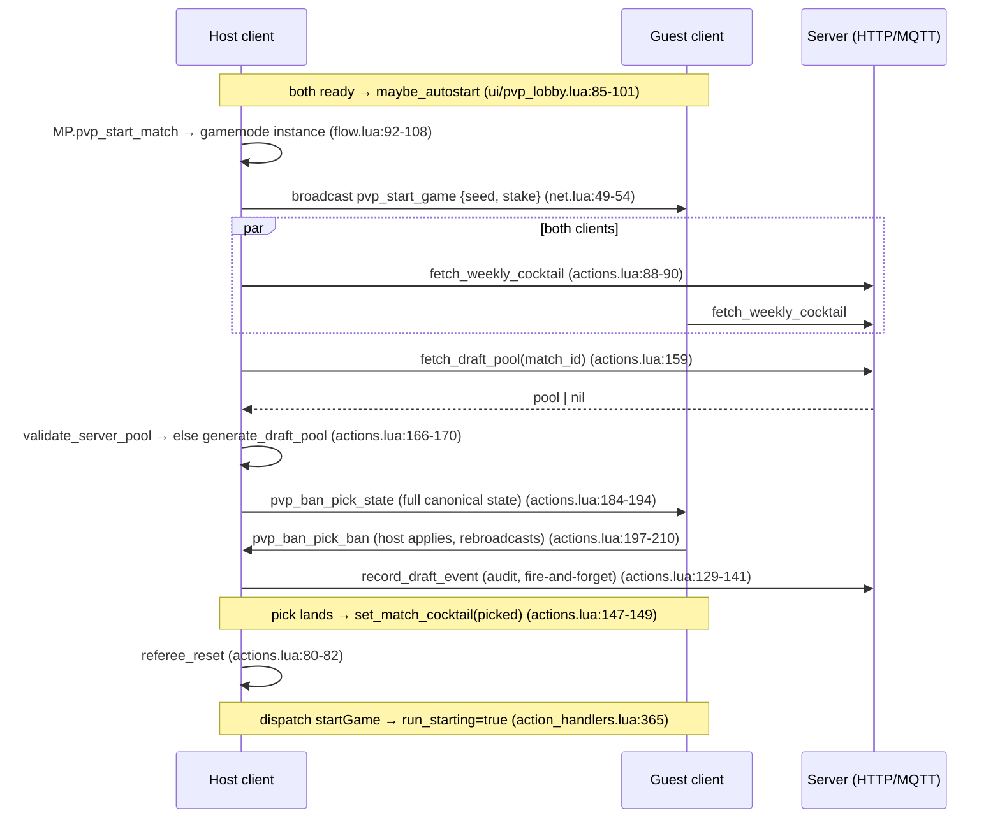
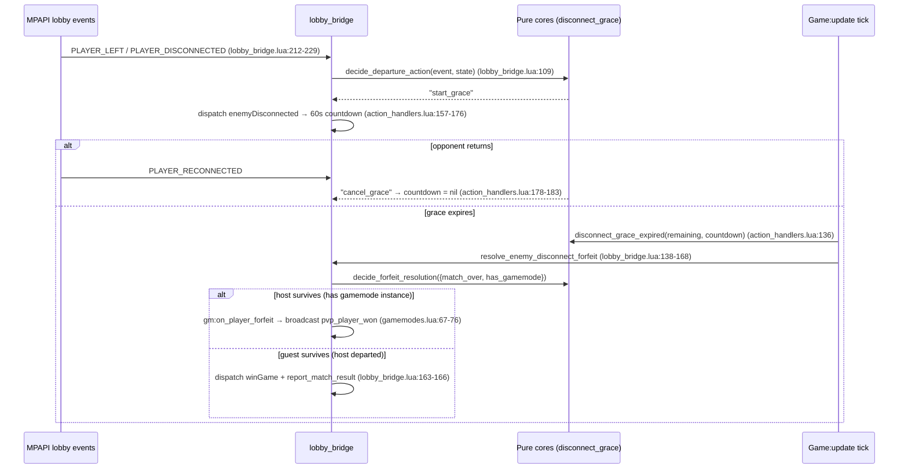
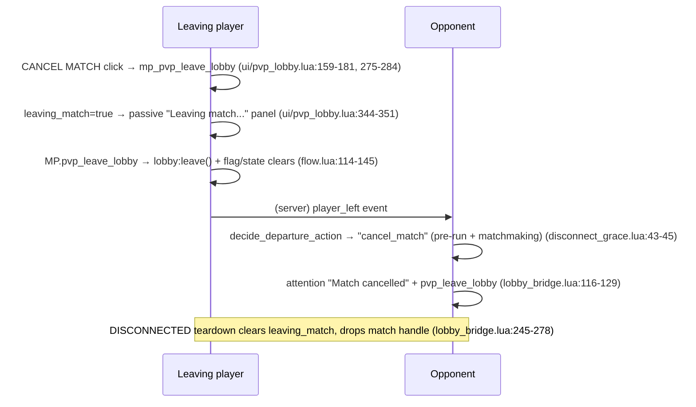

# 07 — The MultiplayerPvP Consumer Mod (`pvp_api/`)

## What this layer owns

`pvp_api/` is the adapter that lets the legacy Multiplayer mod run on top of the new MQTT-based BalatroMultiplayerAPI instead of the old TCP relay server. The rest of the mod (HUD, run flow, gameplay hooks) still reads `MP.LOBBY.*` / `MP.GAME.*` and still emits messages through `Client.send({action=...})` — this layer intercepts both ends: it mirrors the API lobby's events/state into `MP.LOBBY` (lobby_bridge.lua:1-10), rewrites `Client.send` into `pvp_*` ActionType broadcasts (net.lua:186-190), and replaces the server's old adjudication duties with a host-side referee plus pure-Lua decision cores for departures and forfeits. It also owns the matchmaking-only extras: the pre-run deck+stake draft (server pool with local fallback), the weekly cocktail composition, and the CANCEL MATCH escape hatch.

## Key files

| File | Role | The one thing to know |
|---|---|---|
| `pvp_api/lobby_bridge.lua` | Mirrors API lobby → `MP.LOBBY`; routes departure events | `MP.setup_lobby_mirror(lobby)` must run right after create/join/lobby_ready (lobby_bridge.lua:9-11) |
| `pvp_api/net.lua` | Outgoing transport bridge: `Client.send` → `pvp_*` broadcasts | Unlisted legacy actions are *silently dropped* (net.lua:46-47, 179-182) |
| `pvp_api/actions.lua` | All `pvp_*` ActionType handlers (inbound) | Broadcast loops back to sender — relay handlers guard `from == self_id()` (actions.lua:27-33) |
| `pvp_api/disconnect_grace.lua` | Pure cores: `decide_departure_action`, `disconnect_grace_expired`, `decide_forfeit_resolution` | Zero I/O; unit-tested in `tests/test_disconnect_grace.lua` |
| `pvp_api/flow.lua` | Lobby create/join/start; `MP.pvp_leave_lobby` single teardown path | Every leave path funnels here; it clears grace + lifecycle flags (flow.lua:114-145) |
| `pvp_api/gamemodes.lua` | Bridge `MPAPI.GameMode`s (`pvp_standard` etc.) → MP rulesets/gamemodes | Blind hooks are deliberately inert; the one live hook is `on_player_forfeit` (gamemodes.lua:11-16, 67-76) |
| `pvp_api/draft_pool.lua` | Draft pool policy, generator fallback, server-pool validation, cocktail stashes | Server pool failing validation degrades invisibly to local generation (draft_pool.lua:179-182) |
| `pvp_api/queue.lua` | Ranked/casual matchmaking queue + `report_match_result` | `MP._match_handle` outlives the lobby until MATCH_RESOLVED (queue.lua:71-73) |
| `pvp_api/referee.lua` | Host-authoritative match adjudicator (port of the old server) | Every function no-ops on non-host clients (referee.lua:7-8) |
| `ui/pvp_lobby.lua` | Lobby view, ready system, autostart, CANCEL MATCH button | `MP.is_matchmaking()` = `_pvp_kind` is RANKED or CASUAL (ui/pvp_lobby.lua:15-17) |
| `ui/game/` | In-game HUD/round flow (`round.lua` drives nemesis blinds) | MP drives blinds itself via `ui/game/round.lua` + lovely wiring — the API overlay must stay a no-op (gamemodes.lua:11-15) |
| `objects/decks/ZZ_cocktail.lua` | Cocktail deck; consumes `MP._match_cocktail` in matchmaking | Match composition replaces the pool outright: every listed deck forced (ZZ_cocktail.lua:161-178) |

## How it works

### 1. The bridge pattern: API events → `MP.LOBBY` / `MP.GAME`

Two one-way shims. Outbound, `net.lua` replaces the socket transport with a routing table — legacy message names map to `pvp_*` broadcasts, and the old server's payload transforms (attaching skips/lives to `playHand`) happen client-side now:

```lua
-- net.lua:186-190
if Client then
	Client.send = function(msg)
		MP.net_route(msg)
	end
end
```

Inbound, `actions.lua` handlers translate broadcasts back into the legacy client handlers via `MP.dispatch_action` (defined at action_handlers.lua:1462). Since broadcast loops back to the sender, pure relays skip their own echo (actions.lua:27-33), while *authoritative* outcomes (host-computed in referee.lua) are applied by every client including the host via loopback (actions.lua:5-8). State-wise, `lobby_bridge.lua` subscribes to `MPAPI.LobbyEvent.*` and mirrors metadata into `MP.LOBBY.config` — translating the API gamemode key (`pvp_standard`) into MP's own keys through the `MP.PVP_GAMEMODES` table (lobby_bridge.lua:44-49, gamemodes.lua:18-23). The bridge gamemodes keep the API's blind machinery inert (`get_blinds_by_ante` returns nils, gamemodes.lua:61-64) because MP's own round code owns blind selection.

One trap: every `pvp_*` ActionType is registered with `prefix_config = { key = false }` — otherwise SMODS prepends the mod prefix and every lookup by literal key misses (actions.lua:19-22, gamemodes.lua:28-30).

### 2. Departure classification → grace → forfeit (pure cores)

The API's event stream cannot distinguish a deliberate leave from a network drop — `player_left` fires for both, with no reason field (disconnect_grace.lua:3-14). So *every* mid-run opponent departure routes into the same pause/grace flow, and only local grace expiry becomes a forfeit:

```lua
-- disconnect_grace.lua:38-47
if not (state.in_run or state.run_starting) then
	-- Pre-run (matched lobby / draft phase): in MATCHMAKING there is nothing to
	-- salvage ... so an opponent departure cancels the match outright ...
	if state.is_matchmaking and (event == "player_disconnected" or event == "player_left") then
		return "cancel_match"
	end
	return "ignore"
end
```

`handle_departure_event` (lobby_bridge.lua:95-131) builds the state snapshot — `in_run` from `G.STAGE`, `match_over` from `match_decided()` (won/lost flags or `MP.REF.match_over`, lobby_bridge.lua:82-90), `run_starting`, `grace_active`, `is_matchmaking` — and maps the pure verdict to effects: `start_grace` → dispatch `enemyDisconnected` (60 s countdown overlay, action_handlers.lua:157-176), `cancel_grace` → `enemyReconnected`, `cancel_match` → teardown + attention text (lobby_bridge.lua:116-130).

The countdown ticks inside a `Game:update` hook; `MP.disconnect_grace_expired` is the single-fire guard (`countdown.resolved` latch, disconnect_grace.lua:67-72). On expiry, `MP.resolve_enemy_disconnect_forfeit` (lobby_bridge.lua:138-168) asks the second pure core how to resolve:

```lua
-- disconnect_grace.lua:88-96
function MP.decide_forfeit_resolution(state)
	if not state or state.match_over then
		return "none"
	end
	if state.has_gamemode then
		return "host_forfeit"
	end
	return "self_win"
end
```

`host_forfeit` runs the authoritative path: `gm:on_player_forfeit` → `check_single_survivor` → broadcast `pvp_player_won` (gamemodes.lua:67-76), which every client applies as win/lose (actions.lua:325-332). `self_win` is the guest-side escape: the gamemode instance exists only on the host (created in `MP.pvp_start_match`, flow.lua:103-105), so if the *host* departed, the surviving guest resolves its own win locally and reports the result itself (lobby_bridge.lua:156-167).

### 3. Match lifecycle flags and their clearing paths

Three flags steer departure classification, and stale values misroute the *next* match:

- `MP.GAME.run_starting` — latched in `action_start_game` (action_handlers.lua:361-365) to cover the multi-frame window where `startGame` has dispatched but `G.STAGE` is still MAIN_MENU. Without it, a departure during run load would be misread as pre-run and cancel a committed match (disconnect_grace.lua:26-30).
- `MP.GAME.won` / `MP.GAME.lost` — set by `action_win_game` / `action_lose_game` (action_handlers.lua:507, 531); the end screens are still `G.STAGE == RUN`, so these (plus host-side `MP.REF.match_over`, referee.lua:14, 32-38) are the real "match over" signal (lobby_bridge.lua:78-90).
- `MP.enemy_disconnect_countdown` — the live grace object; `~= nil` means grace is active (lobby_bridge.lua:106).

Clearing paths (all three must exist, and reviewers should keep them in sync):

1. **`MP.pvp_leave_lobby`** (flow.lua:114-145) — clears the countdown (flow.lua:124), won/lost/run_starting (flow.lua:125-134), re-arms `MP._result_reported` (flow.lua:135 — otherwise reset only by the host-only `referee_reset`, referee.lua:93-100), and clears `MP._match_cocktail` (flow.lua:137).
2. **`DISCONNECTED` teardown** (lobby_bridge.lua:245-278) — same clears for the case where the lobby dies without a local leave call, plus dropping the matchmaking handle so it can't leak a stale MQTT subscription (lobby_bridge.lua:269-275).
3. **Win/lose handlers** — a decided match invalidates any still-ticking grace countdown so its expiry can never replay a spurious outcome over the end screen (action_handlers.lua:496-502, 520-526).

### 4. Draft pool + weekly cocktail (matchmaking only)

The `pvp_start_game` handler (actions.lua:36-178) is where a matchmade start diverges from a private one. If the gamemode carries a `ban_pick` config (9 tiles, ban 1/3/3 then pick 1 — gamemodes.lua:36-44) and `MP.is_matchmaking()`, a deck+stake draft runs before the run. Only the **host** builds the pool: it fetches the server-issued pool (`MP.fetch_draft_pool`, keyed by `MP._match_handle.match_id`, draft_pool.lua:208-216), then gates it:

```lua
-- actions.lua:158-171
MP.fetch_draft_pool(function(server_pool)
	if lobby ~= MPAPI.get_current_lobby() then
		return  -- staleness guard: never start a draft into a dead lobby
	end
	if server_pool and not MP.validate_server_pool(server_pool, bp.pool_size) then
		sendWarnMessage("[draft] server pool failed validation -- using local generation", ...)
		server_pool = nil
	end
	start_draft(server_pool)
end)
```

`validate_server_pool` checks exact size, every key resolvable in `G.P_CENTERS`, stakes within the compat cap, no duplicate pairs — anything off means "treat as nil", because local generation is the *designed* degradation path (draft_pool.lua:179-202). The fallback `MP.generate_draft_pool` is a Botlatro-parity generator with injectable RNG and feasibility asserts (draft_pool.lua:76-174); guests never generate — they render off the host's `pvp_ban_pick_state` broadcast (actions.lua:172-174, 184-194).

The **weekly cocktail** rides three stashes with distinct scopes: `MP._weekly_cocktail` (per-client fetch at every matchmaking start, cleared on any failure so a stale week can't leak — draft_pool.lua:222-235), tile tags (`tag_weekly_cocktail` attaches the host's composition to cocktail tiles in the pool, which the state broadcast carries to the guest — draft_pool.lua:259-275), and `MP._match_cocktail` — set at draft completion **from the picked item only** (actions.lua:143-150, draft_pool.lua:241-252), so host and guest provably agree on one composition. `ZZ_cocktail.lua` consumes it: in matchmaking, the match composition replaces the pool outright (every listed installed deck forced, nothing else mixes in — ZZ_cocktail.lua:161-178); a cocktail without composition metadata clears the stash and falls back to normal random behaviour (draft_pool.lua:249-251).

## Main flows

### Matchmade start → draft → run



### Opponent departure mid-run → grace → forfeit



### CANCEL MATCH (matchmaking leave, draft included)



## Invariants & gotchas

- **No instant forfeits.** A mid-run departure — leave *or* drop — must always route through grace; only expiry (or `cancel_match` pre-run in matchmaking) ends a match. The event stream cannot disambiguate, so any PR that short-circuits `player_left` into a forfeit reintroduces the network-blip instant-loss bug (disconnect_grace.lua:3-14).
- **Exactly one way a departure ends a match**: `on_player_forfeit → check_single_survivor → pvp_player_won` (lobby_bridge.lua:133-137). The `self_win` branch is the sole, documented exception for a departed host (lobby_bridge.lua:156-162).
- **`in_run` alone is not "mid-match".** End screens are still `G.STAGE == RUN`; `match_over` must come from won/lost/`MP.REF.match_over` (lobby_bridge.lua:78-90). And the run-load window is *not yet* `in_run` — that's what `run_starting` covers (disconnect_grace.lua:26-30).
- **Lifecycle flags must be cleared on every teardown path** — `pvp_leave_lobby` (flow.lua:125-135) *and* the `DISCONNECTED` handler (lobby_bridge.lua:249-259). A stale `won` makes the next draft's departures read as match-over (draft hangs); a stale `run_starting` routes them into grace instead of `cancel_match`.
- **Grace countdown must never outlive its match**: cleared by win (action_handlers.lua:499-502), lose (523-526), leave (flow.lua:124), disconnect (lobby_bridge.lua:251), and `stopGame` (action_handlers.lua:445). Its expiry firing into a menu or the next match is the failure mode each clear prevents.
- **`prefix_config = { key = false }` on every `pvp_*` ActionType and bridge GameMode** — SMODS would otherwise prefix keys to `mp_pvp_*` and every literal-key lookup (referee, net routes, server taxonomy) silently misses (actions.lua:19-22, gamemodes.lua:28-30).
- **One source of truth for the match cocktail**: the picked draft item from the host's state broadcast — never a client's private weekly stash (actions.lua:143-146, draft_pool.lua:237-240). The weekly stash is *tagging input only*, host-side.
- **Autostart re-arm race**: the start handler resets the ready tracker, clearing `start_broadcasted`, while the guest's ready-resync loop is still re-sending — `pvp_start_game` re-latches it so a late resync can't start a live draft a second time (actions.lua:42-48, ui/pvp_lobby.lua:80-101).
- **Async leave**: CANCEL MATCH's `lobby:leave()` round-trips; `leaving_match` must flip the panel passive immediately so a still-live BanPick can't accept input meanwhile (ui/pvp_lobby.lua:160-170, 343-351).

## Review lens

- **Departure/forfeit logic changes**: does the decision live in the pure cores (`decide_departure_action` / `decide_forfeit_resolution`) with a matching case in `tests/test_disconnect_grace.lua`, or has effectful classification crept into `handle_departure_event`? The state snapshot (lobby_bridge.lua:99-108) and the core's expected fields (disconnect_grace.lua:16-17) must stay in lockstep.
- **New match-scoped state** (`MP._*`, `MP.GAME.*` flags): is it cleared in *both* teardown paths — `MP.pvp_leave_lobby` (flow.lua:114-145) *and* the `DISCONNECTED` handler (lobby_bridge.lua:245-278)? One-path clears are the recurring leak bug in this layer.
- **New `pvp_*` ActionTypes**: `prefix_config = { key = false }` set? Loopback handled (guard `from == self_id()` for relays; authoritative outcomes deliberately applied by all)? Registered inside `MPAPI.on_loaded` so routing tags it to this mod (actions.lua:10-11)?
- **Host/guest asymmetry**: anything touching the referee, gamemode instance, draft-pool fetch, or `report_match_result` runs host-only (referee.lua:7-8, actions.lua:158, flow.lua:103-105). A change that assumes those exist on the guest breaks the moment the host departs — check the `self_win`/HOST_CHANGED story.
- **Server data trust boundary**: anything consumed from the server (draft pool, weekly cocktail) must go through a validation gate with a local fallback (`validate_server_pool`, draft_pool.lua:179-202; failure-clears in `fetch_weekly_cocktail`, draft_pool.lua:227-234). A raw-server-value that can crash tile construction on both clients is a match-killer.
- **Bridge purity**: PRs must not let the API's gamemode overlay start mutating blinds/antes — `get_blinds_by_ante` stays `nil,nil,nil` and `on_ante_change` empty (gamemodes.lua:61-64); MP's `ui/game/round.lua` owns that. Double-driving blinds desyncs the clients.
