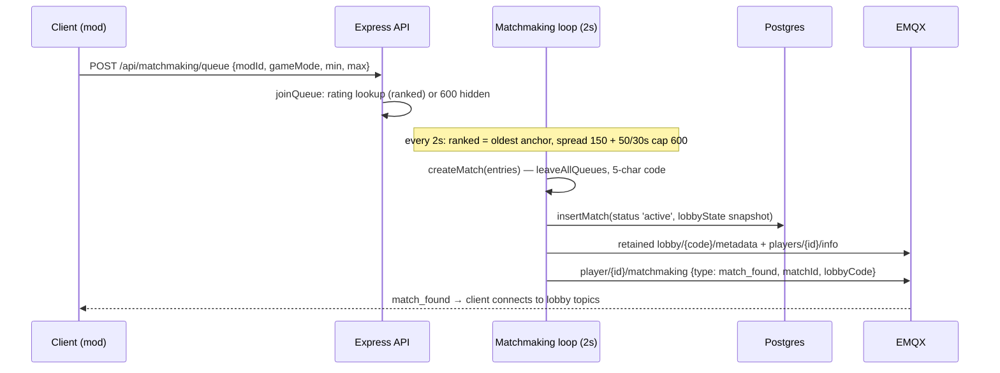
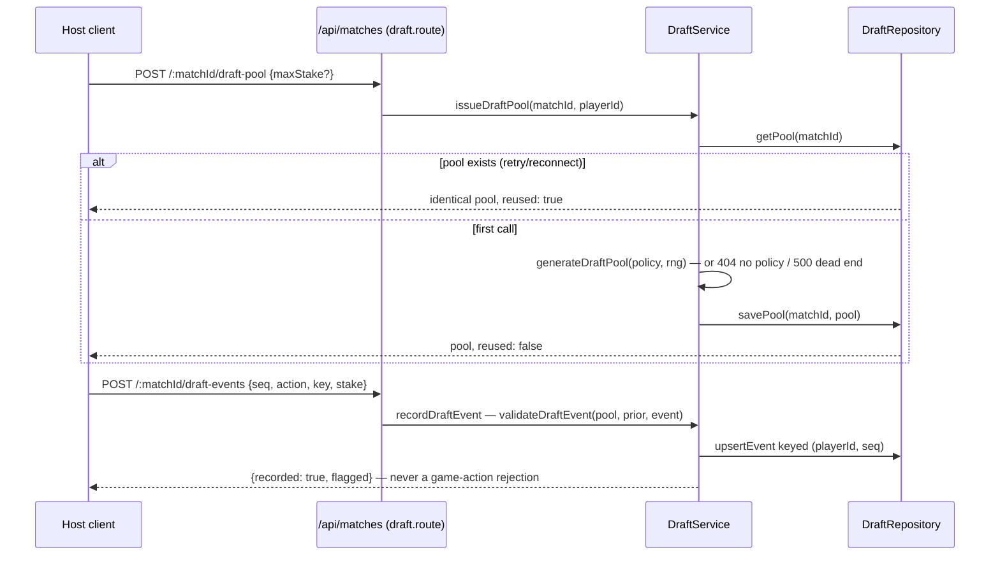
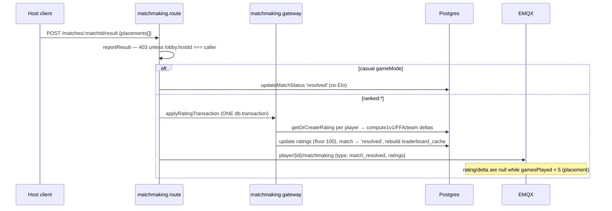

# 09 — The Backend Server

> Source: `D:/Things10/server/apps/server/src` (branch `feat/draft-pool-service`). All file:line references below are relative to that `src/` root.

## What this layer owns

The Node/Express + EMQX backend is the authoritative out-of-game half of the ecosystem: it authenticates players (Steam/Discord, JWT), gatekeeps every MQTT connect/publish/subscribe via EMQX webhooks, runs the 2-second matchmaking loop that turns queues into lobbies + persisted match rows, applies Elo on host-reported results inside one DB transaction, and — new on this branch — issues server-generated draft pools per match and records draft events with facts-only validation. Gameplay itself never routes through here: clients talk to each other over EMQX topics; the server's system MQTT client only publishes lobby metadata, player info, and per-player notifications. It is deliberately a *recorder with opinions, not a referee* for drafts (draft.service.ts:1-9), while it *is* the referee for who may connect, which topic a client may touch, and what a rating is worth.

## Key files

| File | Role | The one thing to know |
|---|---|---|
| `main.ts` | boot/shutdown sequence | Order matters: config → MQTT connect → EMQX webhook provision → `restoreMatchesFromDb()` → matchmaking loop → HTTP listen (main.ts:71-98) |
| `routes/index.ts` | route wiring | Draft endpoints live under `/api/matches` (routes/index.ts:15), config under `/api/config`, admin under `/admin` |
| `infrastructure/mqtt/mqtt.service.ts` | the server's system MQTT client | Retained topics (metadata, player info) are "cleared" by publishing an empty retained payload (mqtt.service.ts:104-106) |
| `features/emqx/emqx-auth.service.ts` | EMQX auth/authz webhook logic | MQTT `clientid` must equal the JWT's `playerId` (emqx-auth.service.ts:54-56); every topic type has its own allow/deny function |
| `features/matchmaking/matchmaking.service.ts` | queues, 2s tick, match creation, restore, result routing | In-memory queues; matches are persisted and restored on boot — queues are not |
| `features/matchmaking/elo.service.ts` | pure Elo math + all tuning constants | Every number a reviewer will argue about lives in lines 1-12 |
| `infrastructure/gateways/matchmaking.gateway.ts` | Drizzle persistence + rating transaction | `applyRatingTransaction` does ratings + match status + leaderboard rebuild in ONE `db.transaction` (matchmaking.gateway.ts:239-363) |
| `features/draft/draft.service.ts` | idempotent pool issue + event recording | Pure `validateDraftEvent` core; anomalies are flagged and logged, never rejected (draft.service.ts:156-184) |
| `features/draft/generate-draft-pool.ts` | pure pool generator (Botlatro port) | Bounded rolls + deterministic fallback; dead-end throws a 500 → client falls back to local generation (generate-draft-pool.ts:149-158) |
| `features/draft/draft-policy.ts` | per-queue deck/stake seed config | Keyed by the same `modId:gameMode` string as queues, with a `modId:*` fallthrough (draft-policy.ts:126-128) |
| `features/draft/draft.repository.ts` | persistence seam (in-memory Phase A) | Event dedup key is `(playerId, seq)` via upsert (draft.repository.ts:104-113); TTL sweep on writes only |
| `features/draft/weekly-cocktail.ts` | rotating Cocktail-deck composition | In-memory, reverts to the seed on restart until the Drizzle migration lands (weekly-cocktail.ts:1-5) |
| `features/auth/auth.service.ts` | sessions, JWT, linking, dev impersonation | `/api/auth/dev/impersonate` 404s in production (auth.route.ts:186-189) and can upsert throwaway accounts by `steamName` in dev (auth.service.ts:317-329) |

## How it works

### 1. EMQX topology: the server publishes, clients are fenced per-topic

The singleton `mqttService` (mqtt.service.ts:180) connects one *system* client with superuser rights (emqx-auth.service.ts:47-49). Server→client unicast goes through `publishToPlayer`:

```ts
// mqtt.service.ts:71-81
async publishToPlayer(playerId: string, subtopic: string, payload: Record<string, unknown>): Promise<void> {
    const topic = `player/${playerId}/${subtopic}`
    await this.publish(topic, JSON.stringify(payload), { qos: 1, retain: false })
}
```

Topic families: `player/{id}/{subtopic}` (subscribe-only, own id only — emqx-auth.service.ts:73-81), `lobby/{code}/events|metadata|players/{id}/info|state|actions|chat`, and the retained global `bmp/notifications/mod-updates` (mqtt.service.ts:83-89). Metadata and player-info are **retained** (mqtt.service.ts:60-69, 109-119) so late joiners get state instantly; cleanup means publishing empty retained payloads (mqtt.service.ts:91-107). Every client connect and every pub/sub is authorized by webhook: the JWT in the MQTT password must verify, the `clientid` must equal the token's `playerId`, a live server session must exist, and current ToS must be accepted (emqx-auth.service.ts:44-67). Per-topic authz is a dispatch of small allow/deny functions — e.g. a player may publish only *their own* `state`, and only a private lobby's host may publish `metadata` (emqx-auth.service.ts:95-114).

### 2. Matchmaking: a 2-second tick with widening ranked spread

Queues are in-memory maps keyed by `modId:gameMode` (state/matchmaking.ts:3-10). `startMatchmaking` runs `runMatchmaking` every `MATCHING_INTERVAL_MS = 2_000` (elo.service.ts:1, matchmaking.service.ts:554-559). Casual queues greedy-fill up to `maxPlayers` (matchmaking.service.ts:318-351). Ranked queues anchor on the **oldest-waiting** entry and widen the acceptable rating band as it waits:

```ts
// matchmaking.service.ts:374-379
const anchorWaitSecs = (Date.now() - anchor.queuedAt.getTime()) / 1000
const spread = Math.min(
    RANKED_SPREAD_INITIAL + Math.floor(anchorWaitSecs / 30) * RANKED_SPREAD_EXPAND_RATE,
    RANKED_SPREAD_CAP,
)
```

That is 150 initially, +50 every 30s, capped at 600 (elo.service.ts:7-9). `createMatch` then: removes all matched players from *all* queues, mints a 5-char lobby code, builds a `public` lobby whose metadata seeds `gamemode` with the `ranked:` prefix stripped (matchmaking.service.ts:441-442), persists the match row with a `StoredLobbyState` snapshot, and unicasts `match_found` to each player (matchmaking.service.ts:497-507). On boot, `restoreMatchesFromDb` rebuilds lobbies/matches from `status='active'` rows and re-publishes retained player info (matchmaking.service.ts:592-631); a re-authenticating player in an active match gets `match_reconnect` (matchmaking.service.ts:653-660). Group queueing exists too: only a private lobby's host may queue the group, and a group's average rating is used for ranked banding (matchmaking.service.ts:130-177).

### 3. Match resolution: host-reported, one transaction, hidden placements

`POST /api/matchmaking/matches/:matchId/result` (matchmaking.route.ts:76-101) → `reportResult`, which rejects non-hosts (matchmaking.service.ts:685-687). Casual matches are just marked `resolved` (689-696). Ranked goes through `applyRatingTransaction`: mode is inferred from placements (`teamId` present → team; exactly 2 → solo 1v1; else FFA — matchmaking.gateway.ts:231-237), and ratings, W/L counters, match status, and the leaderboard cache all update inside one `db.transaction` (matchmaking.gateway.ts:239-363). K-factor decays over the 5 placement games and is performance-scaled:

```ts
// elo.service.ts:19-23
export function effectiveK(gamesPlayed: number, performance: number): number {
    if (gamesPlayed >= PLACEMENT_GAMES) return K_ESTABLISHED   // 40
    const baseK = 200 - gamesPlayed * 40
    return baseK * (1 + clamp(performance, 0, 1))
}
```

FFA divides K by `N-1` across winner-vs-loser virtual matchups (elo.service.ts:78-87); team mode averages each side and applies 1v1 (elo.service.ts:93-138). Ratings floor at 100 (matchmaking.gateway.ts:321) and are reported as `null` while `gamesPlayed < PLACEMENT_GAMES` (matchmaking.gateway.ts:345-352) — the client renders "placement" instead of a number. Daily jobs handle decay (top-100 only, 5 pts/day after 7 idle days — matchmaking.gateway.ts:501-596) and season rollover with a soft reset that halves the distance above 1200 (elo.service.ts:141-146).

### 4. Draft endpoints: recorder-not-referee

Two opt-in endpoints under `/api/matches` (draft.route.ts:36-69). **Pool issue** is idempotent — first call rolls and persists, every retry returns the identical pool — with an in-process single-flight map guarding the check-then-set race (draft.service.ts:98, 122-148). No policy for the queue → 404, which is the client's documented signal to fall back to its own local generation (draft.service.ts:113-114). **Event recording** always stores; the pure core only judges facts the server authored:

```ts
// draft.service.ts:62-83 (validateDraftEvent, abridged)
if (prior.some((e) => e.action === 'pick' && !isRetryOf(e)))
    return { flagged: true, note: 'event-after-completion' }
const inPool = pool.some((t) => t.key === event.key && (event.stake === null || t.stake === event.stake))
if (!inPool) return { flagged: true, note: 'not-in-issued-pool' }
if (alreadyBanned)
    return { flagged: true, note: event.action === 'ban' ? 'already-banned' : 'picked-banned' }
```

It is deliberately schedule-agnostic — no turn-order/actor/count checks — because draft flow is consumer-overridable in the mod (draft.service.ts:4-9). Retries dedupe on `(playerId, seq)` upsert (draft.repository.ts:29-34, 112). Policies seed `MultiplayerPvP:*` plus explicit `ranked:*` rows from one deep-cloned template: 9 tuples, ≤4 per stake, ≤3 per deck, White stake guaranteed (draft-policy.ts:89-96, 115-119). The generator enforces those invariants, honors a client `maxStake` compatibility cap (generate-draft-pool.ts:88-99), and throws loudly on a greedy dead end rather than emitting a malformed tuple (generate-draft-pool.ts:149-158). The **weekly cocktail** is a named 1-3 deck composition validated against `cocktailEligible` flags (weekly-cocktail.ts:37-55), read by clients at `GET /api/config/weekly-cocktail` (config.route.ts:11-13) and rotated deploy-free via `PUT /admin/weekly-cocktail` behind the `x-admin-secret` header (admin.route.ts:24-31).

### The impersonation seam (dev only)

`POST /api/auth/dev/impersonate` accepts `playerId | steamId | discordId | steamName` and returns a full session + JWT (auth.route.ts:184-207). It returns 404 in production (auth.route.ts:186-189). In dev, an unknown `steamName` is upserted as a real queueable account with ToS pre-accepted, so multi-client local testing needs no seeding; id-based lookups still 404 on a miss (auth.service.ts:316-330). This is what the local Player001-004 test clients use.

## Main flows







## Invariants & gotchas

- **Queues are volatile; matches are not.** A restart drops every queue entry silently (in-memory maps, state/matchmaking.ts:3-4) but restores active matches and their lobbies from DB (matchmaking.service.ts:592-631). Anything that must survive a deploy belongs in a match row, not a queue entry.
- **`ranked:` is a gameMode prefix, not a field.** `isRanked` string-checks it (matchmaking.service.ts:48-50), draft policies key on it, and lobby metadata strips it (matchmaking.service.ts:441). A queue key and a policy key must stay the same string, or the queue silently loses its server-driven draft (draft-policy.ts:126-128 falls through to `modId:*`).
- **Draft anomalies are never errors.** `recordDraftEvent` returns 200 with `flagged: true`; only auth/participation/shape problems 4xx (draft.service.ts:100-106, draft.route.ts:50-69). A PR that turns a flag into a rejection breaks the consumer-overridable draft contract stated at draft.service.ts:1-9.
- **Event identity is `(playerId, seq)`, not `seq`.** Two clients both start seq at 0 and never collide (draft.repository.ts:29-34); only the same reporter retrying the same seq is exempt from history checks (draft.service.ts:60-61). Validation using seq alone would flag every second player.
- **Pool idempotency is per-process only.** The single-flight map (draft.service.ts:98) plus in-memory repo make the roll unique in one process; cross-process uniqueness is explicitly deferred to the Drizzle insert-if-absent implementation (draft.service.ts:93-97, draft.repository.ts:4-9). Same for the weekly cocktail: rotation reverts to the seed on restart (weekly-cocktail.ts:3-5).
- **Retained-topic hygiene.** Forgetting the empty-retained-publish cleanup (mqtt.service.ts:91-107) leaves ghost players in reconnecting clients — retained messages outlive the lobby.
- **The first queue entry dictates min/max.** Later joiners with different `minPlayers`/`maxPlayers` get a 409 (matchmaking.service.ts:117-125); the tick also reads min/max from `queue[0]` (matchmaking.service.ts:518-519).
- **Placement hiding is server-side.** `newRating`/`delta` are nulled below 5 games (matchmaking.gateway.ts:345-352) and the leaderboard excludes placement players (matchmaking.gateway.ts:128); don't "fix" a null rating client-side.

## Review lens

- **Constants touched?** All matchmaking/Elo tuning lives in elo.service.ts:1-12. A change there shifts live ladder behavior for every mode — demand the reasoning and check the pure-function tests (`effectiveK`, `compute1v1`, `applySoftReset`) were updated in the same PR.
- **New MQTT topic or ACL change?** Every topic family needs a matching branch in `authorizeAction` (emqx-auth.service.ts:199-218); an unmatched topic is denied, so a new server-published topic clients must subscribe to will silently fail without its authz function. Check retain flags and cleanup for anything retained.
- **Draft validation edits:** the change must stay inside `validateDraftEvent` (pure, draft.service.ts:49-87) and stay facts-only — reject any PR adding turn-order/actor checks or converting `flagged` into an HTTP error. New checks need new pure unit tests, no repo mocks.
- **Anything spanning ratings + match status + leaderboard** must remain inside the single `db.transaction` in `applyRatingTransaction` (matchmaking.gateway.ts:239-363). A second write outside it reintroduces the partial-resolution bug class.
- **Policy/cocktail changes:** deck keys must exist in the client mod, `cocktailEligible` flags gate rotations (weekly-cocktail.ts:44-51), and policies must be deep-cloned per row (draft-policy.ts:103-109) — a shared reference makes independent ranked re-tuning silently impossible.
- **Auth surface:** anything touching `/dev/impersonate` must keep the production 404 (auth.route.ts:186-189); anything touching EMQX auth must keep the `clientid === playerId` and ToS gates (emqx-auth.service.ts:54-64). Admin endpoints stay behind `x-admin-secret` header equality (admin.route.ts:17,26).
